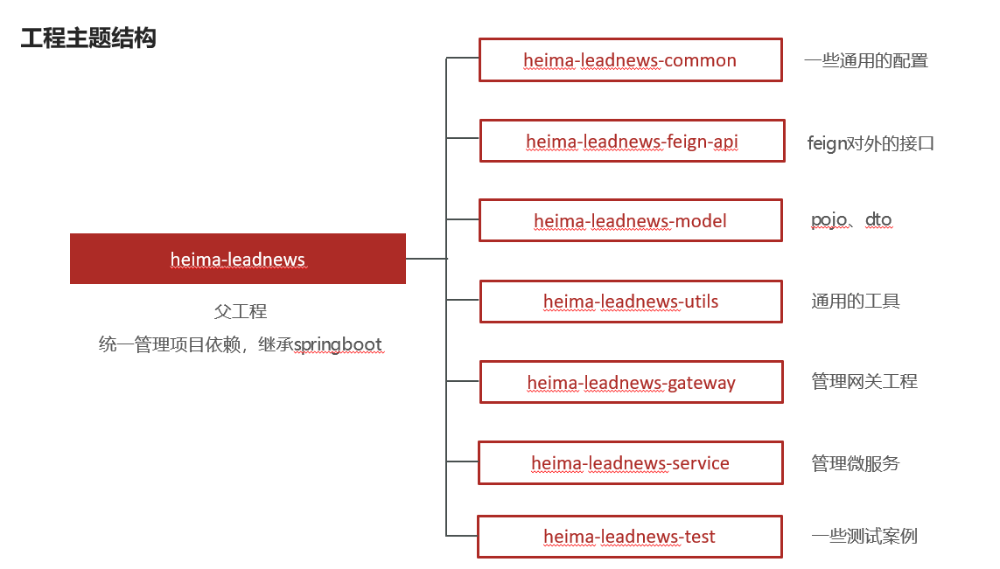
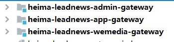
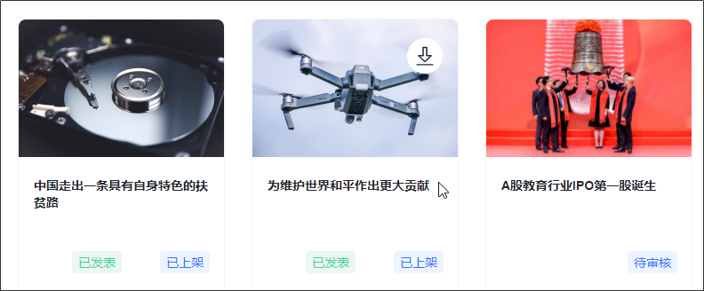
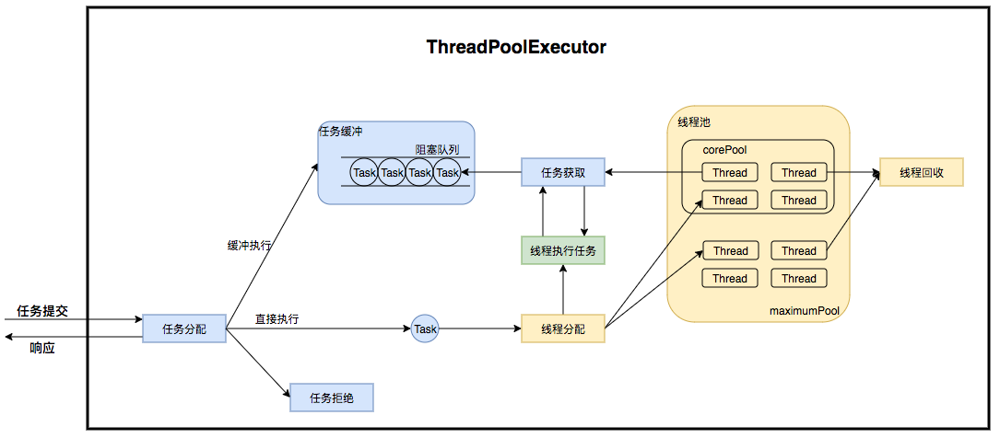

# 项目介绍

黑马头条项目是一个通用信息平台，通过平台发布最新最热的内容资讯，将人与信息进行互联从而创造价值。黑马头条使用了微服务架构，整体技术栈如下：

微服务框架使用Spring Cloud，远程调用feign、负载均衡器ribbon、服务的构建基于Spring Boot。服务注册和发现、配置中心使用Spring Cloud Nacos。

- Spring-Cloud-Gateway : 微服务架设的网关服务，实现服务注册中的API请求路由，以及控制流速控制和熔断处理都是常用的架构手段，而这些功能Gateway天然支持

- 运用Spring Boot快速开发框架，构建项目工程；并结合Spring Cloud全家桶技术，实现后端用户、自媒体、文章等微服务。

- 运用Spring Cloud Alibaba Nacos作为项目中的注册中心和配置中心

  > 微服务架构常用的组件：
  >
  > 注册中心：nacos（Alibaba），eureka(netflix)，consul(netflix)
  > 配置中心：nacos, apollo(携程），consul
  > 远程调用RPC：feign（同步：等调用结果），MQ（异步），dubbo(同步)
  > 网关：gateway（路由（根据url路由到具体的微服务）, 限流，权限控制）
  > 负载均衡：ribbon(微服务做服务均衡（轮询，NacosRule轮询））
  > 熔断降级：hystrix
  > 限流：sentinel

- 运用mybatis-plus作为持久层提升开发效率

  > MP：单表操作（方法调用）
  >
  > MyBatis：多表关联查询（写SQL：注解写在接口，单独xml）

- 运用Kafka完成内部系统消息通知；与客户端系统消息通知；以及实时数据计算

  > (Kafka这块可以切换成RabbitMQ对业务没有影响）

- 运用Redis缓存技术，实现热点数据的存储，提升系统整体性能指标

- 使用Mysql存储用户数据

- 使用Mongo存储用户搜索记录等数据量较大的内容，以保证用户热数据高扩展和高性能指标

  > 表：集合（collection），数据格式bson

- 使用MinIO作为分布式文件系统服务，提供对文章图片的存储（可替换为阿里云OSS等云对象存储服务）

- 运用ES搜索技术（海量数据），支持对文章的搜索，保障了搜索性能【倒排索引】

- 使用freemarker对文章进行静态化的处理，查询文章内容时只需要访问静态文件而不需要访问数据库，提升页面打开的速度并降低了数据库的压力

- 使用jenkins完成项目的持续集成和部署

- 使用redis+数据库实现了轻量级的延迟队列（功能略显简单，可靠性不足，不建议在面试中展开去讲）

  > 使用RabbitMQ的延迟消息，EMQ（物联网，延迟发送）
  
  

# 项目特点和模块

## 平台业务系统划分


app端：用户浏览频道下指定的文章，文章搜索，历史记录查询，点赞、收藏、评论等交互类操作

自媒体端：自媒体人上传素材，编写文章以及文章的发布和查询

管理系统：基础数据的管理、统计报表查询


## 整体技术栈

目前黑马头条中设计的技术栈只是其中的一部分，仅供参考：


脚手架



其中分为三个网关



每个端有独立的网关，独立维护其业务逻辑。


- admin是管理微服务，主要涉及管理数据的维护，例如敏感词
- article是文章微服务，负责对文章进行查询，文章数据从wemedia使用mq异步同步过来
- behavior是行为微服务，负责点赞、收藏、阅读等用户交互行为的处理和数据存储，主要数据均存储在redis中
- schedule是任务微服务，使用数据库和redis实现了一套简单的延迟任务来完成文章延迟发布的业务需求
- search是搜索微服务，负责搜索文章数据、记录用户的搜索记录、关键词联想等功能，主要使用了es和mongodb来实现
- user是用户微服务，负责用户的登录、基本信息查询、实名认证（未实现）等
- wemedia是自媒体微服务，负责自媒体人文章的发布和审核、图片媒体数据的上传


# 负责的模块业务逻辑

## 1.登录逻辑


1. 用户进入网关开始登陆，网关过滤器进行判断，如果是登录，则路由到后台管理微服务进行登录
2. 用户登录成功，后台管理微服务签发JWT信息返回给用户
3. 用户再次进入网关开始访问，网关过滤器接收用户携带的TOKEN 
4. 网关过滤器解析TOKEN ，判断是否有权限，如果有，则放行，如果没有则返回未认证错误


5.从TOKEN中获取用户ID（可以扩展其他用户信息，项目中只存放了用户ID），传递到后端微服务中

6.微服务使用拦截器获取用户ID存放到ThreadLocal中方便使用


参考代码：

1、网关过滤器

```java
package com.heima.wemedia.gateway.filter;


import com.heima.wemedia.gateway.util.AppJwtUtil;
import io.jsonwebtoken.Claims;
import lombok.extern.slf4j.Slf4j;
import org.apache.commons.lang.StringUtils;
import org.springframework.cloud.gateway.filter.GatewayFilterChain;
import org.springframework.cloud.gateway.filter.GlobalFilter;
import org.springframework.core.Ordered;
import org.springframework.http.HttpHeaders;
import org.springframework.http.HttpStatus;
import org.springframework.http.server.reactive.ServerHttpRequest;
import org.springframework.http.server.reactive.ServerHttpResponse;
import org.springframework.stereotype.Component;
import org.springframework.web.server.ServerWebExchange;
import reactor.core.publisher.Mono;

import java.util.function.Consumer;

@Component
@Slf4j
public class AuthorizeFilter implements Ordered, GlobalFilter {
    @Override
    public Mono<Void> filter(ServerWebExchange exchange, GatewayFilterChain chain) {
        //1.获取request和response对象
        ServerHttpRequest request = exchange.getRequest();
        ServerHttpResponse response = exchange.getResponse();

        //2.判断是否是登录
        if(request.getURI().getPath().contains("/login")){
            //放行
            return chain.filter(exchange);
        }

        //3.获取token
        String token = request.getHeaders().getFirst("token");

        //4.判断token是否存在
        if(StringUtils.isBlank(token)){
            response.setStatusCode(HttpStatus.UNAUTHORIZED);
            return response.setComplete();
        }

        //5.判断token是否有效
        try {
            Claims claimsBody = AppJwtUtil.getClaimsBody(token);
            //是否是过期
            int result = AppJwtUtil.verifyToken(claimsBody);
            if(result == 1 || result  == 2){
                response.setStatusCode(HttpStatus.UNAUTHORIZED);
                return response.setComplete();
            }

            //获取用户id,注意根据实际获取到类型进行转型
            Integer id = (Integer) claimsBody.get("id");
            String username = (String) claimsBody.get("username");
            //使用mutate把请求对象变成可变对象
            ServerHttpRequest requestNew = request.mutate().
                    header("userId", String.valueOf(id))
                    .header("username",username)
                    .build();
            //将新生成的对象放到exchange中
            exchange.mutate().request(requestNew).build();

        } catch (Exception e) {
            response.setStatusCode(HttpStatus.UNAUTHORIZED);
            return response.setComplete();
        }

        //6.放行
        return chain.filter(exchange);
    }

    /**
     * 优先级设置  值越小  优先级越高
     * @return
     */
    @Override
    public int getOrder() {
        return 0;
    }
}
```

2、微服务中的拦截器

```java
package com.heima.wemedia.interceptor;

import com.heima.model.wemedia.pojos.WmUser;
import com.heima.utils.thread.WmThreadLocalUtil;
import org.apache.commons.lang3.StringUtils;
import org.springframework.web.servlet.HandlerInterceptor;
import org.springframework.web.servlet.ModelAndView;

import javax.servlet.http.HttpServletRequest;
import javax.servlet.http.HttpServletResponse;

public class WmTokenInterceptor implements HandlerInterceptor {

    @Override
    public void afterCompletion(HttpServletRequest request, HttpServletResponse response, Object handler, Exception ex) throws Exception {
        WmThreadLocalUtil.clear();
    }

    /**
     * 得到header中的用户信息，并且存入到当前线程中
     * @param request
     * @param response
     * @param handler
     * @return 是否要将请求继续放行
     * @throws Exception
     */
    @Override
    public boolean preHandle(HttpServletRequest request, HttpServletResponse response, Object handler) throws Exception {
        String userId = request.getHeader("userId");
        if(StringUtils.isNotBlank(userId)){
            //存入到当前线程中
            WmUser wmUser = new WmUser();
            wmUser.setId(Integer.valueOf(userId));
            String username = request.getHeader("username");
            wmUser.setName(username);
            WmThreadLocalUtil.setUser(wmUser);

        }
        return true;
    }

    /**
     * 清理线程中的数据
     * @param request
     * @param response
     * @param handler
     * @param modelAndView
     * @throws Exception
     */
    @Override
    public void postHandle(HttpServletRequest request, HttpServletResponse response, Object handler, ModelAndView modelAndView) throws Exception {

    }
}
```


## 2.文章发布流程

图片过长分为两段


自媒体人在前端编写完文章之后将数据提交到后端，后端进行处理：

1.如果页面上选择了自动封面，那就根据用户提交的内容中的图片数量进行选择： 超过3张就选前3张，设定为3突。1-2张就选第一张，没有图片就设置Wie无图。

2.接口支持新增和修改，如果携带了文章的ID就是修改逻辑，由于之前保存过文章和图片的关联关系，为了重建关系（关系可能发生了变化）需要先删除。关联关系保存的目的是防止文章存在的情况下，文章内的图片被删除。有了这层关系，我们在删除图片时就可以加一个判断，如果存在关系，就不让用户进行删除。

3.进行新增或者修改的操作。


4.判断如果是草稿，整个流程就结束了，也就是没有保存草稿中图片与文章的关系，草稿中的图片是可以随意删除的，这个逻辑是否合理同学们自行考虑下，本质上应该由产品经理设计，是否保存两种方案均可。

5.将内容中的图片、封面中的图片的素材ID和文章ID保存到关联表中。

参考代码：

```java
/**
 * 发布修改文章或保存为草稿
 *
 * @param dto
 * @return
 */
@Override
public ResponseResult submitNews(WmNewsDto dto) {
    //1.校验参数
    if (dto == null || StringUtils.isBlank(dto.getTitle())
            || StringUtils.isBlank(dto.getContent())) {
        throw new CustomException(AppHttpCodeEnum.PARAM_INVALID);
    }

    //2.拷贝dto到wmnews
    WmNews wmNews = new WmNews();
    BeanUtils.copyProperties(dto, wmNews);

    //提取内容中的图片
    String content = dto.getContent();
    //[{type : text/image value: 文本/图片URL},{},{}]
    List<ContentData> contentData = JSON.parseArray(content, ContentData.class);
    List<String> contentUrls = contentData.stream().filter(data -> "image".equals(data.getType()))
            .map(ContentData::getValue).distinct().collect(Collectors.toList());

    List<String> images = dto.getImages();
    //3.自动封面生成 内容中
    if (Objects.equals(dto.getType(), WemediaConstants.WM_NEWS_TYPE_AUTO)) {
        //处理封面 0无图 1-2单图 >=3多图
        int size = contentUrls.size();
        if (size >= 3) {
            images = contentUrls.subList(0, 3);
            wmNews.setType(WemediaConstants.WM_NEWS_MANY_IMAGE);
        } else if (size >= 1) {
            images = contentUrls.subList(0, 1);
            wmNews.setType(WemediaConstants.WM_NEWS_SINGLE_IMAGE);
        } else {
            images = new ArrayList<>();
            wmNews.setType(WemediaConstants.WM_NEWS_NONE_IMAGE);
        }
    }
    //设置封面图片到wmNews
    if (!CollectionUtils.isEmpty(images)) {
        wmNews.setImages(StringUtils.join(images, ","));
    }

    //保存到数据库

    wmNews.setUserId(WmThreadLocalUtil.getUser().getId());
    if(Objects.equals(dto.getStatus(),WmNews.Status.SUBMIT.getCode())){
        //如果是提交
        wmNews.setSubmitedTime(new Date());
    }
    if(dto.getId() != null){
        //删除关联关系
        wmNewsMaterialMapper.delete(Wrappers.<WmNewsMaterial>lambdaQuery()
                .eq(WmNewsMaterial::getNewsId,dto.getId()));
        //更新
        updateById(wmNews);
    }else{
        //新增
        wmNews.setCreatedTime(new Date());
        wmNews.setEnable((short)1);
        save(wmNews);
    }

    if(Objects.equals(dto.getStatus(),WmNews.Status.NORMAL.getCode())){
        //如果是草稿，直接返回
        return ResponseResult.okResult(null);
    }

    //保存封面
    saveMaterialAndNewsRelation(images,wmNews.getId(),WemediaConstants.WM_COVER_REFERENCE);
    //保存内容
    saveMaterialAndNewsRelation(contentUrls,wmNews.getId(),WemediaConstants.WM_CONTENT_REFERENCE);

    return ResponseResult.okResult(null);
}

 public void saveMaterialAndNewsRelation(List<String> urls,Integer newsId,Short type){
        if(CollectionUtils.isEmpty(urls)){
            return;
        }
        //select id
        LambdaQueryWrapper<WmMaterial> in = Wrappers.<WmMaterial>lambdaQuery()
                .select(WmMaterial::getId)
                .in(WmMaterial::getUrl, urls);
        List<WmMaterial> wmMaterials = wmMaterialMapper.selectList(in);

        if(wmMaterials.size() != urls.size()){
            throw new CustomException(AppHttpCodeEnum.DATA_NOT_EXIST);
        }
        List<Integer> ids = wmMaterials.stream().map(WmMaterial::getId).collect(Collectors.toList());

        wmNewsMaterialMapper.saveRelations(ids,newsId,type);

    }
```

批量保存的sql:

```xml
<insert id="saveRelations">
    insert into wm_news_material (material_id,news_id,type,ord)
    values
    <foreach collection="materialIds" separator="," item="data" index="index">
        (#{data},#{newsId},#{type},#{index})
    </foreach>
</insert>
```


## 3.文章审核逻辑


1.自媒体端发布文章后，开始审核文章

2.审核的主要是审核文章的内容（文本内容和图片）

3.借助第三方提供的接口审核文本

4.借助第三方提供的接口审核图片，由于图片存储到minIO中，需要先下载才能审核

5.如果审核失败，则需要修改自媒体文章的状态，status:2  审核失败    status:3  转到人工审核

6.如果审核成功，则需要在文章微服务中创建app端需要的文章

**这里的逻辑存在一定问题，图片应该在上传到素材库的时候进行审核，而不应该放在文章发布时审核，主要原因是同一个图片可能会被很多文章包含，只需要审核一次，如果放在发布时审核就会出现多次审核。**

参考代码：

```java
package com.heima.wemedia.service.impl;

import com.alibaba.fastjson.JSONArray;
import com.baomidou.mybatisplus.core.toolkit.Wrappers;
import com.heima.apis.article.IArticleClient;
import com.heima.common.aliyun.GreenImageScan;
import com.heima.common.aliyun.GreenTextScan;
import com.heima.common.tess4j.Tess4jClient;
import com.heima.file.service.FileStorageService;
import com.heima.model.article.dtos.ArticleDto;
import com.heima.model.common.dtos.ResponseResult;
import com.heima.model.wemedia.pojos.WmChannel;
import com.heima.model.wemedia.pojos.WmNews;
import com.heima.model.wemedia.pojos.WmSensitive;
import com.heima.model.wemedia.pojos.WmUser;
import com.heima.utils.common.SensitiveWordUtil;
import com.heima.wemedia.mapper.WmChannelMapper;
import com.heima.wemedia.mapper.WmNewsMapper;
import com.heima.wemedia.mapper.WmSensitiveMapper;
import com.heima.wemedia.mapper.WmUserMapper;
import com.heima.wemedia.service.WmNewsAutoScanService;
import io.seata.spring.annotation.GlobalTransactional;
import lombok.extern.slf4j.Slf4j;
import org.apache.commons.lang3.StringUtils;
import org.springframework.beans.BeanUtils;
import org.springframework.beans.factory.annotation.Autowired;
import org.springframework.scheduling.annotation.Async;
import org.springframework.stereotype.Service;
import org.springframework.transaction.annotation.Transactional;

import javax.imageio.ImageIO;
import java.awt.image.BufferedImage;
import java.io.ByteArrayInputStream;
import java.util.*;
import java.util.stream.Collectors;


@Service
@Slf4j
@Transactional
public class WmNewsAutoScanServiceImpl implements WmNewsAutoScanService {

    @Autowired
    private WmNewsMapper wmNewsMapper;

    /**
     * 自媒体文章审核
     *
     * @param id 自媒体文章id
     */
    @Override
    @Async
    @GlobalTransactional
    public void autoScanWmNews(Integer id) {
        //1.查询自媒体文章
        WmNews wmNews = wmNewsMapper.selectById(id);
        if(wmNews == null){
            throw new RuntimeException("WmNewsAutoScanServiceImpl-文章不存在");
        }

        if(wmNews.getStatus().equals(WmNews.Status.SUBMIT.getCode())){
            //从内容中提取纯文本内容和图片
            Map<String,Object> textAndImages = handleTextAndImages(wmNews);

            //2.审核文本内容  阿里云接口
            boolean isTextScan = handleTextScan((String) textAndImages.get("content"),wmNews);
            if(!isTextScan)return;

            //自管理的敏感词过滤
            boolean isSensitive = handleSensitiveScan((String) textAndImages.get("content"), wmNews);
            if(!isSensitive) return;

            //3.审核图片  阿里云接口
            boolean isImageScan =  handleImageScan((List<String>) textAndImages.get("images"),wmNews);
            if(!isImageScan)return;

            //4.审核成功，保存app端的相关的文章数据
            ResponseResult responseResult = saveAppArticle(wmNews);
            if(!responseResult.getCode().equals(200)){
                throw new RuntimeException("WmNewsAutoScanServiceImpl-文章审核，保存app端相关文章数据失败");
            }
            //回填article_id
            wmNews.setArticleId((Long) responseResult.getData());
//            int a = 1/0;
            updateWmNews(wmNews,(short) 9,"审核成功");

        }
    }

    @Autowired
    private WmSensitiveMapper wmSensitiveMapper;

    /**
     * 自管理的敏感词审核
     * @param content
     * @param wmNews
     * @return
     */
    private boolean handleSensitiveScan(String content, WmNews wmNews) {

        boolean flag = true;

        //获取所有的敏感词
        List<WmSensitive> wmSensitives = wmSensitiveMapper.selectList(Wrappers.<WmSensitive>lambdaQuery().select(WmSensitive::getSensitives));
        List<String> sensitiveList = wmSensitives.stream().map(WmSensitive::getSensitives).collect(Collectors.toList());

        //初始化敏感词库
        SensitiveWordUtil.initMap(sensitiveList);

        //查看文章中是否包含敏感词
        Map<String, Integer> map = SensitiveWordUtil.matchWords(content);
        if(map.size() >0){
            updateWmNews(wmNews,(short) 2,"当前文章中存在违规内容"+map);
            flag = false;
        }

        return flag;
    }

    @Autowired
    private IArticleClient articleClient;

    @Autowired
    private WmChannelMapper wmChannelMapper;

    @Autowired
    private WmUserMapper wmUserMapper;

    /**
     * 保存app端相关的文章数据
     * @param wmNews
     */
    @Override
    public ResponseResult saveAppArticle(WmNews wmNews) {

        ArticleDto dto = new ArticleDto();
        //属性的拷贝
        BeanUtils.copyProperties(wmNews,dto);
        //文章的布局
        dto.setLayout(wmNews.getType());
        //频道
        WmChannel wmChannel = wmChannelMapper.selectById(wmNews.getChannelId());
        if(wmChannel != null){
            dto.setChannelName(wmChannel.getName());
        }

        //作者
        dto.setAuthorId(wmNews.getUserId().longValue());
        WmUser wmUser = wmUserMapper.selectById(wmNews.getUserId());
        if(wmUser != null){
            dto.setAuthorName(wmUser.getName());
        }

        //设置文章id
        if(wmNews.getArticleId() != null){
            dto.setId(wmNews.getArticleId());
        }
        dto.setCreatedTime(new Date());

        ResponseResult responseResult = articleClient.saveArticle(dto);
        return responseResult;

    }


    @Autowired
    private FileStorageService fileStorageService;

    @Autowired
    private GreenImageScan greenImageScan;

    @Autowired
    private Tess4jClient tess4jClient;

    /**
     * 审核图片
     * @param images
     * @param wmNews
     * @return
     */
    private boolean handleImageScan(List<String> images, WmNews wmNews) {

        boolean flag = true;

        if(images == null || images.size() == 0){
            return flag;
        }

        //下载图片 minIO
        //图片去重
        images = images.stream().distinct().collect(Collectors.toList());

        List<byte[]> imageList = new ArrayList<>();

        try {
            for (String image : images) {
                byte[] bytes = fileStorageService.downLoadFile(image);

                //图片识别文字审核---begin-----

                //从byte[]转换为butteredImage
                ByteArrayInputStream in = new ByteArrayInputStream(bytes);
                BufferedImage imageFile = ImageIO.read(in);
                //识别图片的文字
                String result = tess4jClient.doOCR(imageFile);

                //审核是否包含自管理的敏感词
                boolean isSensitive = handleSensitiveScan(result, wmNews);
                if(!isSensitive){
                    return isSensitive;
                }

                //图片识别文字审核---end-----


                imageList.add(bytes);

            }
        }catch (Exception e){
            e.printStackTrace();
        }


        //审核图片
        try {
            Map map = greenImageScan.imageScan(imageList);
            if(map != null){
                //审核失败
                if(map.get("suggestion").equals("block")){
                    flag = false;
                    updateWmNews(wmNews, (short) 2, "当前文章中存在违规内容");
                }

                //不确定信息  需要人工审核
                if(map.get("suggestion").equals("review")){
                    flag = false;
                    updateWmNews(wmNews, (short) 3, "当前文章中存在不确定内容");
                }
            }

        } catch (Exception e) {
            flag = false;
            e.printStackTrace();
        }
        return flag;
    }

    @Autowired
    private GreenTextScan greenTextScan;

    /**
     * 审核纯文本内容
     * @param content
     * @param wmNews
     * @return
     */
    private boolean handleTextScan(String content, WmNews wmNews) {

        boolean flag = true;

       /* if((wmNews.getTitle()+"-"+content).length() == 0){
            return flag;
        }*/

        try {
            Map map = greenTextScan.greeTextScan((wmNews.getTitle()+"-"+content));
            if(map != null){
                //审核失败
                if(map.get("suggestion").equals("block")){
                    flag = false;
                    updateWmNews(wmNews, (short) 2, "当前文章中存在违规内容");
                }

                //不确定信息  需要人工审核
                if(map.get("suggestion").equals("review")){
                    flag = false;
                    updateWmNews(wmNews, (short) 3, "当前文章中存在不确定内容");
                }
            }
        } catch (Exception e) {
            flag = false;
            e.printStackTrace();
        }

        return flag;

    }

    /**
     * 修改文章内容
     * @param wmNews
     * @param status
     * @param reason
     */
    private void updateWmNews(WmNews wmNews, short status, String reason) {
        wmNews.setStatus(status);
        wmNews.setReason(reason);
        wmNewsMapper.updateById(wmNews);
    }

    /**
     * 1。从自媒体文章的内容中提取文本和图片
     * 2.提取文章的封面图片
     * @param wmNews
     * @return
     */
    private Map<String, Object> handleTextAndImages(WmNews wmNews) {

        //存储纯文本内容
        StringBuilder stringBuilder = new StringBuilder();

        List<String> images = new ArrayList<>();

        //1。从自媒体文章的内容中提取文本和图片
        if(StringUtils.isNotBlank(wmNews.getContent())){
            List<Map> maps = JSONArray.parseArray(wmNews.getContent(), Map.class);
            for (Map map : maps) {
                if (map.get("type").equals("text")){
                    stringBuilder.append(map.get("value"));
                }

                if (map.get("type").equals("image")){
                    images.add((String) map.get("value"));
                }
            }
        }
        //2.提取文章的封面图片
        if(StringUtils.isNotBlank(wmNews.getImages())){
            String[] split = wmNews.getImages().split(",");
            images.addAll(Arrays.asList(split));
        }

        Map<String, Object> resultMap = new HashMap<>();
        resultMap.put("content",stringBuilder.toString());
        resultMap.put("images",images);
        return resultMap;

    }
}
```


## 4.文章上下架逻辑

点击上下架按钮可以将文章进行上下架，下架的文章无法被用户查看。




- 已发表且已上架的文章可以下架

- 已发表且已下架的文章可以上架


实现流程：


1.自媒体微服务查询文章状态是否为发布状态，如果是修改下enable值（注意这里的设计比较别扭enable为1是上架 0是下架）

2.封装消息对象传递到kafka中，其中包含articleId文章Id和enable上下架状态

3.文章微服务收到消息之后修改数据库中的字段is_down的值（注意这里的is_down 0是上架 1是下架，所以需要把enable的值颠倒一下）


**参考代码：**

自媒体微服务：

```java
/**
 * 文章的上下架
 * @param dto
 * @return
 */
@Override
public ResponseResult downOrUp(WmNewsDto dto) {
    //1.检查参数
    if(dto.getId() == null){
        return ResponseResult.errorResult(AppHttpCodeEnum.PARAM_INVALID);
    }

    //2.查询文章
    WmNews wmNews = getById(dto.getId());
    if(wmNews == null){
        return ResponseResult.errorResult(AppHttpCodeEnum.DATA_NOT_EXIST,"文章不存在");
    }

    //3.判断文章是否已发布
    if(!wmNews.getStatus().equals(WmNews.Status.PUBLISHED.getCode())){
        return ResponseResult.errorResult(AppHttpCodeEnum.PARAM_INVALID,"当前文章不是发布状态，不能上下架");
    }

    //4.修改文章enable
    if(dto.getEnable() != null && dto.getEnable() > -1 && dto.getEnable() < 2){
        update(Wrappers.<WmNews>lambdaUpdate().set(WmNews::getEnable,dto.getEnable())
                .eq(WmNews::getId,wmNews.getId()));

        //发送消息，通知article端修改文章配置
        if(wmNews.getArticleId() != null){
            Map<String,Object> map = new HashMap<>();
            map.put("articleId",wmNews.getArticleId());
            map.put("enable",dto.getEnable());
            kafkaTemplate.send(WmNewsMessageConstants.WM_NEWS_UP_OR_DOWN_TOPIC,JSON.toJSONString(map));
        }
    }
    return ResponseResult.okResult(AppHttpCodeEnum.SUCCESS);
}
```

文章微服务：

```java
/**
 * 修改文章配置
 * @param map
 */
@Override
public void updateByMap(Map map) {
    //0 下架 1 上架
    Object enable = map.get("enable");
    boolean isDown = true;
    if(enable.equals(1)){
        isDown = false;
    }
    //修改文章配置
    update(Wrappers.<ApArticleConfig>lambdaUpdate().eq(ApArticleConfig::getArticleId,map.get("articleId"))
            .set(ApArticleConfig::getIsDown,isDown));

}
```


## 5.文章页面静态化生成

由于文章页面访问频率很高，所以项目中将所有文章都生成静态文件放到MinIO中保存，这样访问详情页时只需要访问MinIO中已经生成的页面，不需要再访问数据库。


具体实现流程如下：


1.通过freemarker将数据库中的文章内容和模板进行处理，生成静态页面

2.将静态页面上传到minIO并获取文件链接地址

3.将文件链接地址保存到文章表中，以便后续访问时加载对应的页面


## 6.项目部署

本项目采用jenkins自动化部署方案，实现自动集成和部署。


1.jenkins拉取gitlab上的代码到本地

2.在本地进行构建，打包成jar包

3.将jar包发送到服务器上，执行运行脚本进行运行

>这一部分不建议过多的提到docker，目前企业中docker一般无法脱离类似于k8s等容器管理平台独立存在，所以在面试中尽量少提及docker相关的内容


# 项目中的难点和优化

## 1.JWT是什么？

参考阅读：https://www.zhihu.com/question/485758060/answer/2257869896

- jwt是没有加密的只是使用base64编码，可以通过解码恢复到原始数据。

- jwt里边包含敏感信息一定手动对jwt加密签名的作用：防止当前jwt被人篡改，使用签名验证当前数据是否和原数据相同

### 什么是双token机制？

用户登录成功的时候， 一次性给他两个Token， 分别为Access Token和Refresh Token。

- Access Token有效期较短， 比如1天或者5天， 用于正常请求 。
- Refresh Token有效期可以设置长一些， 例如10天、20天， 作为刷新Access Token的凭证。

##### 刷新方案 

当Access Token即将过期的时候， 例如提前30分钟， 客户端利用Refresh Token请求指定的API获取新的Access Token并更新本地存储中 的Access Token。

1、登录成功后， jwt生成Access Token；UUID生成Refresh Token并存储在服务端redis中， 设置过期时间 

2、接口返回3个字段Access Token/Refresh Token/访问令牌过期时间戳 

3、由于Refresh Token存储在服务端redis中， 假如这个Refresh Token也过期， 则提示重新登录；


## 2.token过期如何处理？

```
jwt自动续期：jwt在生成的时候过期时间已经固定
jwt退出登录：登录成功时存入Redis，退出登录时从Redis删除，每次请求校验token（检查Redis中是否存在）
```

（1）JWT的续签问题和终止问题
JWT的优势在于无状态，也就是生成的Token中本身有存储信息（payload），所以不需要依赖Redis和DB。JWT本身也有有效期参与签名，问题在于这个有效期不能更改，也很好理解如果参与签名的参数（有效期）发生变化，Token也就不一样了。如果有效期不能改变，即便时间设计的再长，也会有到期的时候，而且Token这种设计初衷也不能有效期很长，导致用户在操作过程中Token到期授权失败，这种情况根本是无法接受的。

另外，JWT的Token签发之后，理论上在到期之前是始终有效的，在有些场景下，比如用户更改/重置密码，踢出登录（单一用户登录），都需要让对应用户在其他电脑（终端）上自动退出登录，也就是要让其他的Token马上失效，所以需要额外设计来解决这两个问题。

（2）非JWT的授权流程
以前登录Token一般是放在服务端的Session中，Session有过期时间，也会自动延期，当然我们现在绝大部分项目都不会使用session来存储了。下面的方案用普通的UUID作为token，返回到前端后，前端每次请求都会带上这个token作为授权凭证。这种方案是能够自动续签，也能做到主动终止。我之前的很多项目都采用了这种也没什么大的问题。缺点就是需要依赖Redis和数据库。


 

（3）JWT的授权流程
解决JWT自动续签有几个解决方案

每次请求都返回新的Token，这种简单粗暴，不存在续签的问题，不过相信很多人不会用，请求量大的话性能损耗也是比较明显。

生成的JWT，不加入过期时间，在服务端Redis额外存储一个对应的过期时间，并每次操作延期。这种设计感觉很多余，既然保存到了Redis，JWT从无状态变成了有状态，既然能够保存过期时间，为啥不把用户信息都保存到Redis中，何必用JWT加密后前后端传来传去没有意义。

临近过期刷新JWT，返回新的Token，很多人也采用的是这种方案。

主动终止问题

JWT签发后就生效，无法做到主动终止，我的方案还是用到了Redis，把用户id作为key，生成一个用户唯一ID（用户指纹）存入Redis，并参与JWT签发过程；

如果更改了密码需要终止其他所有已经签发的JWT，只需要更改这个用户指纹；

在JWT验签过程中，验证用户指纹，如果和JWT中信息不一致授权失败，也就是做到了主动终止JWT的目的。

需要注意的是，在高并发过程中写入用户指纹过程可能要用到分布式锁。


## 3.项目如何保持es数据和数据库数据的一致性？

方案1（推荐）：

使用logstash将数据库中的数据定时同步到es中

方案2：

目前项目中的实现是首次使用代码的方式批量将数据库中的数据一次性同步到es中，但是代码注意如果数据量过大，要分批进行同步。后续增量数据使用mq异步消息的方式将数据同步到搜索微服务中并更新到es。


## 4.项目中@Async注解的使用是否存在问题？

> @Async: 使用一个新线程来执行方法

@Async注解在使用时，不指定线程池的名称，@Async的默认线程池为**SimpleAsyncTaskExecutor**。，该线程池默认来一个任务创建一个线程，若系统中不断的创建线程，最终会导致系统占用内存过高，引发OutOfMemoryError错误。



如何自定义线程池：

https://blog.csdn.net/weixin_50391597/article/details/123001266

另外，由于线程池只是将任务存放在内存中如果服务宕机，此时任务也会中断待审核的文章就永远处于待审核状态。所以此类异步任务建议使用mq来解决，比如rabbitmq就有更多的可靠性保障机制。

