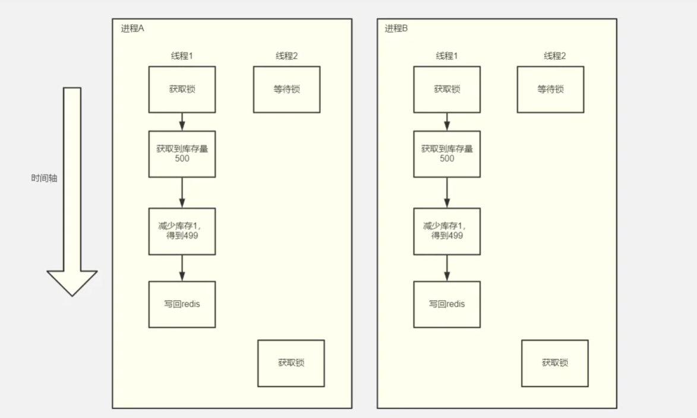

相信很多同学都听说过分布式锁，但也仅仅停留在概念的理解上，这篇文章会从分布式锁的应用场景讲起，从实现的角度上深度剖析redis如何实现分布式锁。

# 一、超卖问题

我们先来看超卖的概念：
当宝贝库存接近0时，如果多个买家同时付款购买此宝贝，或者店铺后台在架数量大于仓库实际数量，将会出现超卖现象。超卖现象本质上就是买到了比仓库中数量更多的宝贝。

> 本文主要解决超卖问题的第一种，同时多人购买宝贝时，造成超卖。

## 测试代码

那么超卖问题是如何产生的呢？我们准备一段代码进行测试：

```java
@Autowired
private StringRedisTemplate stringRedisTemplate;

/**
 * 第一种实现，进程内就存在线程安全问题
 * 可以只启动一个进程测试
 */
@RequestMapping("/deduct_stock1")
public void deductStock1(){

    String stock = stringRedisTemplate.opsForValue().get("stock");
    int stockNum = Integer.parseInt(stock);
    if(stockNum > 0){
        //设置库存减1
        int realStock = stockNum - 1;
        stringRedisTemplate.opsForValue().set("stock",realStock + "");
        System.out.println("设置库存" + realStock);
    }else{
        System.out.println("库存不足");
    }

}
```
这段代码中，使用redis先获取库存数量

```dart
 String stock = stringRedisTemplate.opsForValue().get("stock");
 int stockNum = Integer.parseInt(stock);
```

接下来，判断库存数是否大于0：

- 如果大于0，将库存数减一，通过set命令，写回redis

```csharp
  //设置库存减1
  int realStock = stockNum - 1;
  stringRedisTemplate.opsForValue().set("stock",realStock + "");
  System.out.println("设置库存" + realStock);
```

- 如果小于等于0，提示库存不足

## JMeter测试

通过JMeter进行并发测试，看下会不会出现超卖的问题:

### 1.启动tomcat

这种情况下，只需要启动一个tomcat就会出现超卖。我们先启动一个tomcat在8080端口上。

### 2.下载JMeter

Apache JMeter是Apache组织开发的基于Java的压力测试工具。
 从官网上下载即可：
https://jmeter.apache.org/download_jmeter.cgi
 下载完之后解压，运行bin目录下的jmeter.bat，显示如下界面：


 如果嫌字体太小，可以选择放大：


### 3.配置JMeter

在Test Plan上点击右键，创建`线程组(Thread Group)`


配置一下具体参数：


- `Number of Threads` 同时并发线程数
- `Ramp-Up Period(in-seconds)` 代表隔多长时间执行，0代表同时并发。假设线程数为100， 估计的点击率为每秒10次， 那么估计的理想ramp-up period 就是 100/10 = 10 秒
- `Loop Count` 循环次数

> 这里给出500是为了直接测试并发500抢，看看能不能正好把500个货物抢完。

添加Http请求：http://localhost:8080/deduct_stock1


添加聚合结果，用来显示整体的运行情况:


到此为止JMeter的配置结束。

### 4.设置库存量

启动redis-server，使用redis-client连接:


把库存数设置为500。

### 5.开始测试

点击运行按钮，启动测试:


首先我们看到聚合报告里输出的结果:


错误率0%，样本数500，证明500个请求都已经执行，但是发现控制台输出如下:

 


 很显然，一份商品都被卖了多次，这显然是不合理的。

## 原因分析

现在我们只启动了一个tomcat，在单jvm进程的情况下，tomcat会使用线程池接收请求：

 


而由于每个线程可能同时获取到库存量，所以库存量在两个线程中显示的都是500，然后两个线程就继续进行扣减库存操作，得出499写回redis中，在这个过程中，显然存在线程安全的问题。同一个商品被卖出了2份，超卖问题就出现了。

# 二、加锁优化

## synchronized锁

要保证单jvm中线程安全，最简单直接的方式就是添加synchronized关键字，那么这样行不行呢？

我们来做一个测试:

```csharp
  /**
     * 第二种实现，使用synchronized加锁
     * 可以只启动一个进程测试
     */
    @RequestMapping("/deduct_stock2")
    public void deductStock2(){

        synchronized (this){
            String stock = stringRedisTemplate.opsForValue().get("stock");
            int stockNum = Integer.parseInt(stock);
            if(stockNum > 0){
                //设置库存减1
                int realStock = stockNum - 1;
                stringRedisTemplate.opsForValue().set("stock",realStock + "");
                System.out.println("设置库存" + realStock);
            }else{
                System.out.println("库存不足");
            }
        }

    }
```

在进行扣减库存前，先通过synchronized关键字，对资源加锁，这样就只有一个线程能进入到扣减库存的代码块中。来测试一下：

### 重置库存

```bash
set stock 500
```

### 修改接口地址

http://localhost:8080/deduct_stock2


### 测试


可以看到，库存被扣减为0，并且没有出现超卖的情况(设置了500库存，并且500个人抢，正好抢完)。
 但是这种方案显然是不行的，在生产环境上如果部署**多个tomcat实例**，那么就会出现如下情况:



**多个进程无法共享jvm内存中的锁**，所以会出现多把锁，这种情况下也会出现超卖问题。

# 二、分布式锁的实现

## 多Tomcat实例下的超卖演示

接下来我们演示一下如何在多个Tomcat情况下，演示超卖的问题:

### 1.启动两个tomcat服务

在IDEA中配置两个spring boot的启动项，使用vm参数指定不同的端口号

```undefined
-Dserver.port=8080
```


```
-Dserver.port=8081
```


### 2.配置nginx

编写nginx.conf如下：

```nginx
#user  nobody;
worker_processes  1;

events {
    worker_connections  1024;
}

http {
    include       mime.types;
    default_type  application/octet-stream;

    sendfile        on;
    #tcp_nopush     on;
    keepalive_timeout  65;

	upstream redislock{
		 server 127.0.0.1:8080 weight=1;
		 server 127.0.0.1:8081 weight=1;
	}

	 server {
        listen       10085;
        server_name  localhost;
		location /{
			   root html;
			   proxy_pass http://redislock;
		}
	}
}
```

启动nginx，访问：http://localhost:10085/deduct_stock2

### 3.测试

修改接口地址为nginx：http://localhost:10085/deduct_stock2

运行查看两个tomcat的控制台：

 

```abap
 没有将库存清空，证明存在超卖问题。
```


## 手动实现分布式锁

使用redis手动实现分布式锁，需要用到命令`setnx`。先来介绍一下setnx：

### SETNX key value[]

> 可用版本： >= 1.0.0
>
> 时间复杂度： O(1)

只在键 `key` 不存在的情况下， 将键 `key` 的值设置为 `value` 。

若键 `key` 已经存在， 则 `SETNX` 命令不做任何动作。

`SETNX` 是『SET if Not eXists』(如果不存在，则 SET)的简写。

#### 返回值

命令在设置成功时返回 `1` ， 设置失败时返回 `0` 。

#### 代码示例

```bash
redis> EXISTS job                # job 不存在
# job 不存在
(integer) 0

redis> SETNX job "programmer"    # job 设置成功
(integer) 1

redis> SETNX job "code-farmer"   # 尝试覆盖 job ，失败
(integer) 0

redis> GET job                   # 没有被覆盖
```

使用redis构建分布式锁流程如下：


- 线程1申请锁(`setnx`)，拿到了锁。
- 线程2申请锁，由于线程1已经拥有了锁，`setnx`返回0失败，这一步用户操作会失败。
- 线程1执行扣减库存操作并释放锁。
- 线程2再次申请锁，获取到锁并执行扣减库存，然后释放锁。

> 注意这里线程没有拿到锁，如果不尝试while(true)重新获取锁，这个操作就直接失败了。

### 代码实现

```csharp
/**
     * 第三种实现，使用redis中的setIfAbsent(setnx命令)实现分布式锁
     */
    @RequestMapping("/deduct_stock3")
    public void deductStock3(){

        //在获取到锁的时候，给锁分配一个id
        String opId = UUID.randomUUID().toString();
        Boolean stockLock = stringRedisTemplate
                .opsForValue().setIfAbsent("stockLock", opId, Duration.ofSeconds(30));

        if(stockLock){

            try{
                String stock = stringRedisTemplate.opsForValue().get("stock");
                int stockNum = Integer.parseInt(stock);
                if(stockNum > 0){
                    //设置库存减1
                    int realStock = stockNum - 1;
                    stringRedisTemplate.opsForValue().set("stock",realStock + "");
                    System.out.println("设置库存" + realStock);
                }else{
                    System.out.println("库存不足");
                }

            }catch(Exception e){
                e.printStackTrace();
            }finally {
                if(opId.equals(stringRedisTemplate
                        .opsForValue().get("stockLock"))){
                    //判断锁和删除锁的原子性
                    stringRedisTemplate.delete("stockLock");
                }
            }

        }

    }
```

测试略过，这里有几个知识点需要说明

#### setIfAbsent设置超时

如果setIfAbsent不设置超时时间，假设线程执行业务代码时间时死锁或者其他原因导致长时间不释放，那么会影响其他线程获取到锁，这个时候整体业务就会出现不可用。

```java
Boolean stockLock = stringRedisTemplate
            .opsForValue().setIfAbsent("stockLock", opId, Duration.ofSeconds(30);
```
设置超时时间为30秒，**该时间一般大于业务执行的最大时间**。

#### 每次获取到锁，设置唯一ID

考虑这样的场景


- 线程1获取锁扣减库存，但是由于操作不当，长时间卡住，这样会触发超时时间锁被释放。
- 线程2获取到锁，扣减库存。
- 线程1的代码抛出异常，执行finally释放锁，但是释放的是进程B的锁。
   解决方案就是在**加锁前生成UUID**，释放的时候校验UUID是否正确，如果不正确说明加锁线程不是当前线程。

## 使用Redisson实现分布式锁

setnx虽好，但是实现起来毕竟太过麻烦，一不小心就可能陷入并发编程的陷阱中，那么有没有更加简单的实现方式呢？答案就是`redisson`。

> Redisson是架设在[Redis](https://links.jianshu.com/go?to=http%3A%2F%2Fwww.oschina.net%2Fp%2Fredis)基础上的一个Java驻内存数据网格（In-Memory Data Grid）。【[Redis官方推荐](https://links.jianshu.com/go?to=http%3A%2F%2Fwww.redis.io%2Fclients)】
>  Redisson在基于NIO的[Netty](https://links.jianshu.com/go?to=http%3A%2F%2Fnetty.io%2F)框架上，充分的利用了Redis键值数据库提供的一系列优势，在Java实用工具包中常用接口的基础上，为使用者提供了一系列具有分布式特性的常用工具类。使得原本作为协调单机多线程并发程序的工具包获得了协调分布式多机多线程并发系统的能力，大大降低了设计和研发大规模分布式系统的难度。同时结合各富特色的分布式服务，更进一步简化了分布式环境中程序相互之间的协作。

总而言之，`redisson`提供了一系列较为完善的工具类，其中就包含了分布式锁。用`redisson`实现分布式锁的流程极为简单。

### 引入依赖

```xml
<dependency>
    <groupId>org.redisson</groupId>
    <artifactId>redisson</artifactId>
    <version>3.14.0</version>
</dependency>
```

### 创建Redisson实例

```java
@Bean
public RedissonClient redisson() {
    // 1. Create config object
    Config config = new Config();
    config.useSingleServer().setAddress("redis://127.0.0.1:6379");
    //config.useClusterServers()
             //use "rediss://" for SSL connection
            //.addNodeAddress("redis://127.0.0.1:6379", "redis://127.0.0.1:7181");
    return Redisson.create(config);
}
```

### 编写分布式锁代码

```java
  @Autowired
    private RedissonClient redissonClient;
    /**
     * 第四种实现，使用redisson实现
     */
    @RequestMapping("/deduct_stock4")
    public void deductStock4(){

        RLock lock = redissonClient.getLock("redisson:stockLock");
        try{
            //加锁
            lock.lock();
            String stock = stringRedisTemplate.opsForValue().get("stock");
            int stockNum = Integer.parseInt(stock);
            if(stockNum > 0){
                //设置库存减1
                int realStock = stockNum - 1;
                stringRedisTemplate.opsForValue().set("stock",realStock + "");
                System.out.println("设置库存" + realStock);
            }else{
                System.out.println("库存不足");
            }

        }catch(Exception e){
            e.printStackTrace();
        }finally {
            lock.unlock();
        }

    }
```

其中加锁代码基本与进程内加锁一致，就不再详细解读，读者自行实践即可。

### Redisson分布式锁原理

`Redisson分布式锁`的主要原理非常简单，利用了**lua脚本的原子性**。
 在分布式环境下产生并发问题的主要原因是三个操作并不是原子操作:

- 获取库存
- 扣减库存
- 写入库存

那么如果我们把三个操作合并为一个操作，在默认单线程的Redis中运行，是不会产生并发问题的。源码如下：

```csharp
 <T> RFuture<T> tryLockInnerAsync(long waitTime, long leaseTime, TimeUnit unit, long threadId, RedisStrictCommand<T> command) {
        internalLockLeaseTime = unit.toMillis(leaseTime);

        return evalWriteAsync(getName(), LongCodec.INSTANCE, command,
                "if (redis.call('exists', KEYS[1]) == 0) then " +
                        "redis.call('hincrby', KEYS[1], ARGV[2], 1); " +
                        "redis.call('pexpire', KEYS[1], ARGV[1]); " +
                        "return nil; " +
                        "end; " +
                        "if (redis.call('hexists', KEYS[1], ARGV[2]) == 1) then " +
                        "redis.call('hincrby', KEYS[1], ARGV[2], 1); " +
                        "redis.call('pexpire', KEYS[1], ARGV[1]); " +
                        "return nil; " +
                        "end; " +
                        "return redis.call('pttl', KEYS[1]);",
                Collections.singletonList(getName()), internalLockLeaseTime, getLockName(threadId));
    }
```

这一段源码中，`redisson`利用了lua脚本的原子性，校验key是否存在，如果不存在就创建key并利用incrby加一操作（这步操作主要是为了实现可重入性）。`redisson`实现的分布式锁具备如下特性:

- 锁失效
- 锁续命

> 执行时间长的锁快要到期时会自动续命

- 可重入
- 操作原子性

# 总结

本文介绍了超卖问题产生的原因：操作不具备原子性，同时提出了集中解决思路。

- `synchronized锁`，无法保证多实例下的线程安全
- `setnx`手动实现，坑很多、代码较为复杂
- `redisson`实现，能够保证多实例下线程安全，代码简单可靠
