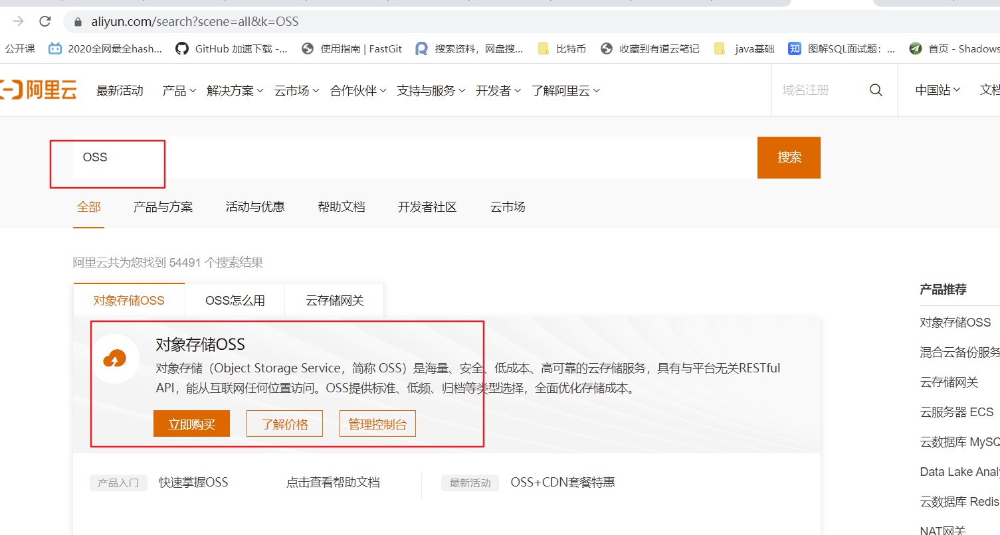
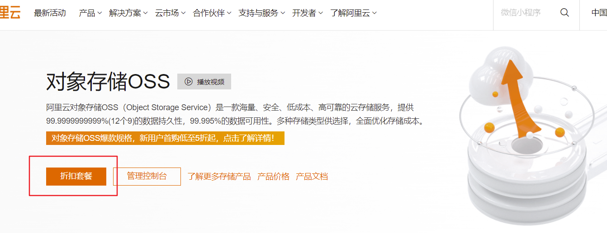
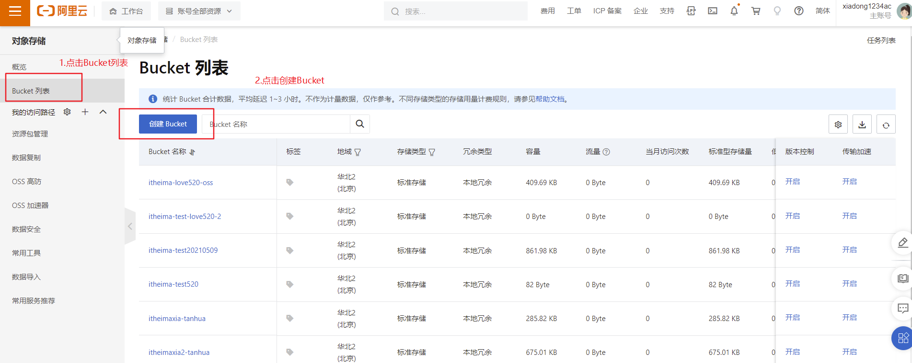
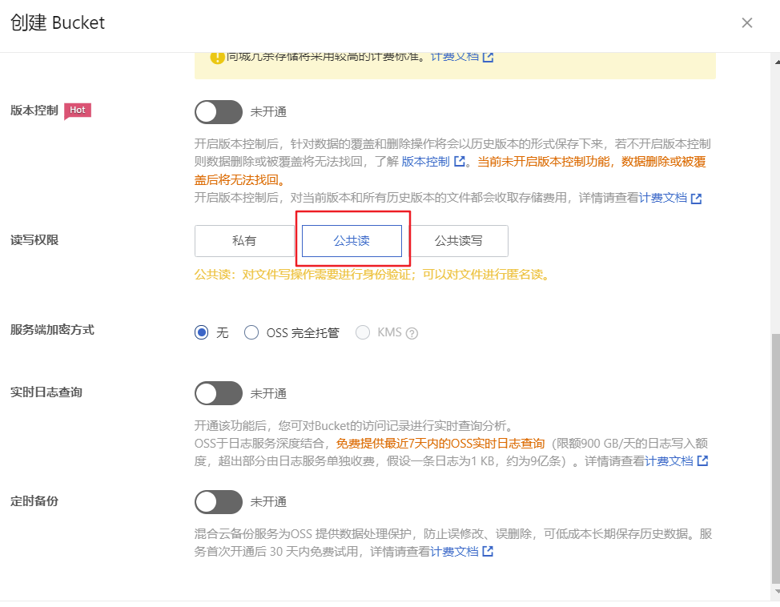
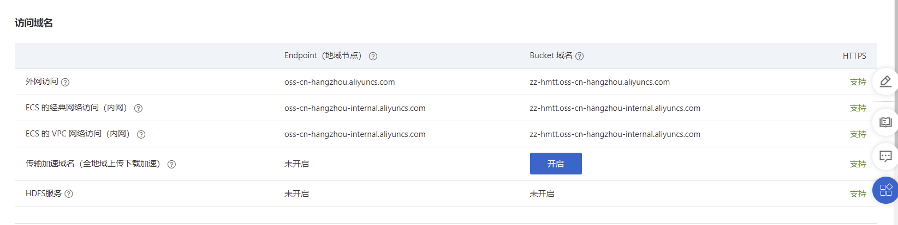
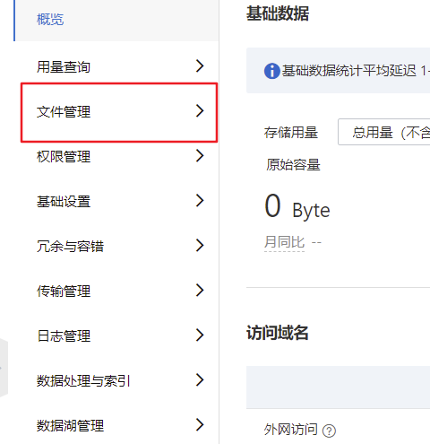
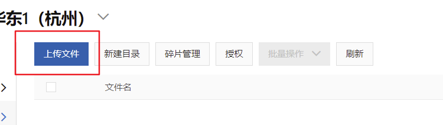
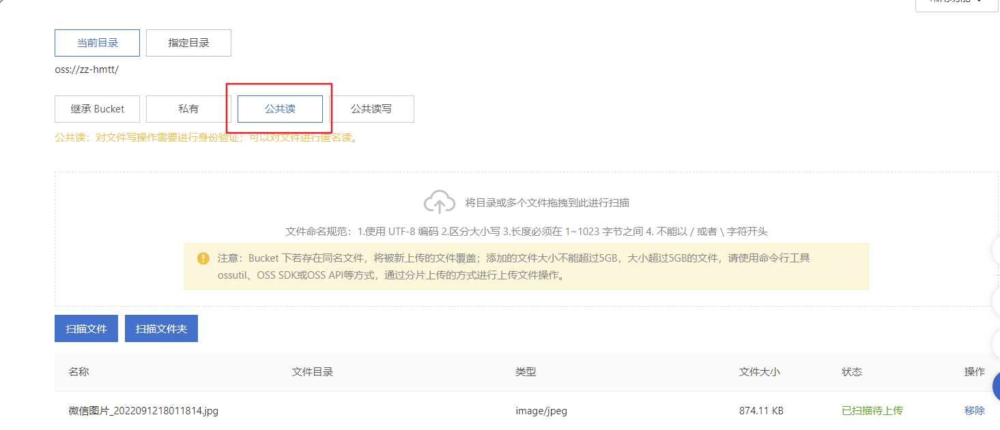
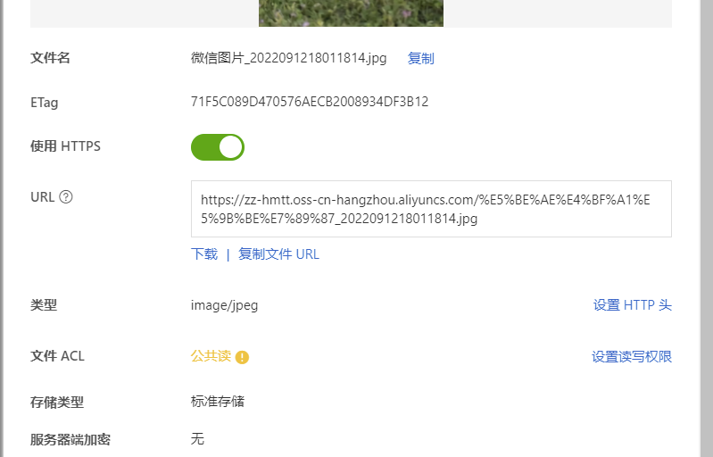
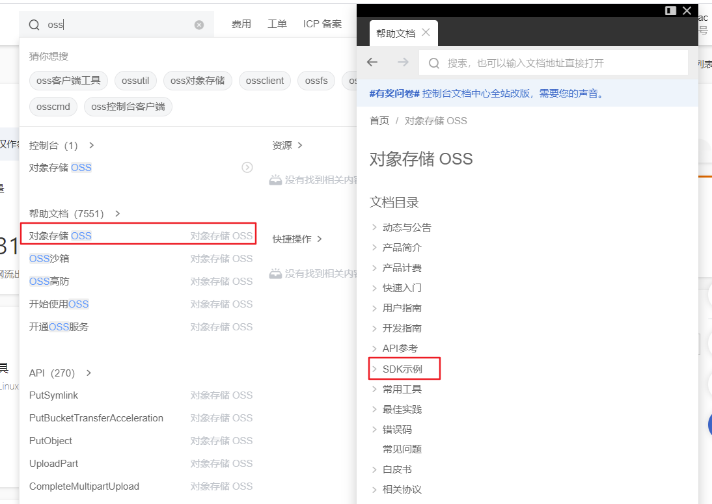

# 开通OSS

1.在阿里云https://www.aliyun.com/上搜索OSS，点击标题对象存储OSS，进入详情页




2.如果没有开通，折扣套餐显示的应该是立即开通，点击开通然后进入管理控制台




3.创建bucket：https://oss.console.aliyun.com/overview

```
桶名称：zz-leadnews
```



选择公共读




4.页面上会显示访问域名，一会儿使用




5.测试

点击文件管理



上传一个文件



选择公共读，上传文件



可以看到文件管理中已经有这个文件


点击详情，查看文件的外链



这个URL就是文件最终的外链地址，默认这个链接是直接下载文件


# 整合代码

打开阿里云OSS的文档，参考里边的示例：

https://help.aliyun.com/document_detail/52834.html?spm=5176.8465980.tools.2.4e701450M9wlft



整合添加依赖

```xml
<dependency>
    <groupId>com.aliyun.oss</groupId>
    <artifactId>aliyun-sdk-oss</artifactId>
    <version>3.15.0</version>
</dependency>
```


heima-file-starter中添加以下代码：

```java
package com.heima.file.config;


import lombok.Data;
import org.springframework.boot.context.properties.ConfigurationProperties;

import java.io.Serializable;

@Data
@ConfigurationProperties(prefix = "oss")  // 文件上传
public class OSSConfigProperties implements Serializable {

    private String endpoint;
    private String accessKeyId;
    private String accessKeySecret;
    private String bucket;
    private String accessEndpoint;
}
```


```java
package com.heima.file.config;

import com.aliyun.oss.OSS;
import com.aliyun.oss.OSSClientBuilder;
import com.heima.file.service.FileStorageService;
import io.minio.MinioClient;
import lombok.Data;
import org.springframework.beans.factory.annotation.Autowired;
import org.springframework.boot.autoconfigure.condition.ConditionalOnClass;
import org.springframework.boot.context.properties.EnableConfigurationProperties;
import org.springframework.context.annotation.Bean;
import org.springframework.context.annotation.Configuration;

/**
 * 阿里云OSS配置
 */
@Data
@Configuration
@EnableConfigurationProperties({OSSConfigProperties.class})
//当引入FileStorageService接口时
@ConditionalOnClass(FileStorageService.class)
public class OssConfig {

    @Autowired
    private OSSConfigProperties ossConfigProperties;

    @Bean
    public OSS buildOSSClient() {
        return new OSSClientBuilder().build(ossConfigProperties.getEndpoint(),
                ossConfigProperties.getAccessKeyId(),
                ossConfigProperties.getAccessKeySecret());
    }
}
```


编写实现类：

```java
package com.heima.file.service.impl;


import com.aliyun.oss.OSS;
import com.aliyun.oss.model.OSSObject;
import com.aliyun.oss.model.ObjectMetadata;
import com.heima.file.config.MinIOConfig;
import com.heima.file.config.MinIOConfigProperties;
import com.heima.file.config.OSSConfigProperties;
import com.heima.file.config.OssConfig;
import com.heima.file.service.FileStorageService;
import com.sun.org.apache.bcel.internal.generic.RETURN;
import io.minio.GetObjectArgs;
import io.minio.MinioClient;
import io.minio.PutObjectArgs;
import io.minio.RemoveObjectArgs;
import lombok.extern.slf4j.Slf4j;
import org.springframework.beans.factory.annotation.Autowired;
import org.springframework.boot.context.properties.EnableConfigurationProperties;
import org.springframework.context.annotation.Import;
import org.springframework.util.StringUtils;

import java.io.ByteArrayOutputStream;
import java.io.IOException;
import java.io.InputStream;
import java.text.SimpleDateFormat;
import java.util.Date;

@Slf4j
@EnableConfigurationProperties(OSSConfigProperties.class)
@Import(OssConfig.class)
public class OSSFileStorageService implements FileStorageService {

    @Autowired
    private OSS oss;

    @Autowired
    private OSSConfigProperties ossConfigProperties;

    public static String getcontentType(String FilenameExtension) {
        if (FilenameExtension.equalsIgnoreCase(".bmp")) {
            return "image/bmp";
        }
        if (FilenameExtension.equalsIgnoreCase(".gif")) {
            return "image/gif";
        }
        if (FilenameExtension.equalsIgnoreCase(".jpeg") ||
                FilenameExtension.equalsIgnoreCase(".jpg") ||
                FilenameExtension.equalsIgnoreCase(".png")) {
            return "image/jpg";
        }
        if (FilenameExtension.equalsIgnoreCase(".html")) {
            return "text/html";
        }
        if (FilenameExtension.equalsIgnoreCase(".txt")) {
            return "text/plain";
        }
        if (FilenameExtension.equalsIgnoreCase(".vsd")) {
            return "application/vnd.visio";
        }
        if (FilenameExtension.equalsIgnoreCase(".pptx") ||
                FilenameExtension.equalsIgnoreCase(".ppt")) {
            return "application/vnd.ms-powerpoint";
        }
        if (FilenameExtension.equalsIgnoreCase(".docx") ||
                FilenameExtension.equalsIgnoreCase(".doc")) {
            return "application/msword";
        }
        if (FilenameExtension.equalsIgnoreCase(".xml")) {
            return "text/xml";
        }
        return "image/jpg";
    }


    /**
     *  上传图片文件
     * @param prefix  文件前缀
     * @param filename  文件名
     * @param inputStream 文件流
     * @return  文件全路径
     */
    @Override
    public String uploadImgFile(String prefix, String filename,InputStream inputStream) {

        ObjectMetadata objectMetadata = new ObjectMetadata();
        objectMetadata.setContentType(getcontentType(filename.substring(filename.lastIndexOf("."))));

        oss.putObject(ossConfigProperties.getBucket(), filename, inputStream,objectMetadata);
        return ossConfigProperties.getAccessEndpoint() + filename;
    }

    /**
     *  上传html文件
     * @param prefix  文件前缀
     * @param filename   文件名
     * @param inputStream  文件流
     * @return  文件全路径
     */
    @Override
    public String uploadHtmlFile(String prefix, String filename,InputStream inputStream) {
        ObjectMetadata objectMetadata = new ObjectMetadata();
        objectMetadata.setContentType(getcontentType(filename.substring(filename.lastIndexOf("."))));

        oss.putObject(ossConfigProperties.getBucket(), filename, inputStream,objectMetadata);
        return ossConfigProperties.getAccessEndpoint() + filename;
    }

    /**
     * 删除文件
     * @param pathUrl  文件全路径
     */
    @Override
    public void delete(String pathUrl) {
        String fileName = pathUrl.replace(ossConfigProperties.getAccessEndpoint(), "");
        oss.deleteObject(ossConfigProperties.getBucket(),fileName);
    }


    /**
     * 下载文件
     * @param pathUrl  文件全路径
     * @return  文件流
     *
     */
    @Override
    public byte[] downLoadFile(String pathUrl)  {
        String fileName = pathUrl.replace(ossConfigProperties.getAccessEndpoint(), "");
        OSSObject ossObject = oss.getObject(ossConfigProperties.getBucket(), fileName);
        InputStream inputStream = null;
        try {
            inputStream = ossObject.getObjectContent();
        } catch (Exception e) {
            log.error("oss down file error.  pathUrl:{}",pathUrl);
            e.printStackTrace();
        }

        ByteArrayOutputStream byteArrayOutputStream = new ByteArrayOutputStream();
        byte[] buff = new byte[100];
        int rc = 0;
        while (true) {
            try {
                if (!((rc = inputStream.read(buff, 0, 100)) > 0)) break;
            } catch (IOException e) {
                e.printStackTrace();
            }
            byteArrayOutputStream.write(buff, 0, rc);
        }
        try {
            inputStream.close();
        } catch (IOException e) {
            e.printStackTrace();
        }
        return byteArrayOutputStream.toByteArray();
    }
}
```

在自动配置的spring.factories文件中修改为：

```yml
org.springframework.boot.autoconfigure.EnableAutoConfiguration=\
  com.heima.file.service.impl.OSSFileStorageService
```


自媒体服务中添加OSS配置：

```yml
#阿里云OSS配置
oss:
  endpoint: https://oss-cn-hangzhou.aliyuncs.com
  accessKeyId: xxx  #换成自己的
  accessKeySecret: xxx #换成自己的
  bucket: zz-leadnews
  #桶的访问地址最后必须加上/
  accessEndpoint: https://zz-leadnews.oss-cn-hangzhou.aliyuncs.com/
```