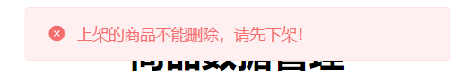

# 黑马商城实战需求文档


# 1.搭建运行环境

实战资料包括三部分，如图：

 


## 1.1.导入SQL文件

找到资料中的SQL目录，其中包含一个sql脚本：

 

导入其中的SQL文件导入后，包括5张表：

 

其中：

- tb_address：用户地址表
- tb_item：商品表
- tb_order：用户订单表
- tb_order_detail：订单详情表，主要是订单中包含的商品信息
- tb_order_logistics：订单物流表，订单的收货人信息
- tb_user：用户表，其中包含用户的详细信息


## 1.2.导入Demo工程

代码目录包括两个部分


其中的hm-mall是微服务项目，导入IDEA后，结构如图：

解读：

- feign-api：是通用的api模块，一些feign的客户端、实体类、工具类都可以放这里
- item-service：商品微服务，负责商品的CRUD
- order-service：订单微服务，负责订单的CRUD
- user-service：用户微服务，负责用户的CRUD、用户地址的CRUD
- search-service-是搜索服务,负责商品的查询及

> **注意**：需要修改每个项目中的application.yml文件，其中的**端口**信息、**数据库**信息都需要修改为自己的信息。

## 1.3.前端页面

前端页面分两个部分都: 含在内 nginx-1.18.0\web 目录内

- hm-mall-admin：后台的商品管理页面
- hm-mall-portal：用户入口，搜索、购买商品、下单的页面

前端页面需要通过nginx来部署，达到下面的目的：

| server_name | port | 代理目标       |
| ----------- | ---- | -------------- |
| localhost   | 9001 | hm-mall-admin  |
| localhost   | 9002 | hm-mall-portal |

前端已配置好, 需要把nginx 复制到没有中文没有空格的目录中

```nginx
同时修改
\nginx-1.18.0\conf\leadnews.conf\ 中的配置为自己的文件夹目录
```


部署成功后，访问：http://localhost:9001，效果如图：


其中的axios发送请求地址已经配置为10010，也就是网关端口:


访问：http://localhost:9002，效果如图：


其中的axios发送请求地址已经配置为10010，也就是网关端口：


## 1.4.启动nacos

按照之前学习的方式，启动一台单节点运行的nacos服务。

```
.\startup.cmd -m standalone
```


## 1.5.配置网关

### 1.5.1.创建网关服务

在hmall-parent中创建微服务：gateway，效果如图：

 


> 注意：gateway服务的端口要与前端axios的请求端口一致


### 1.5.2.配置网关路由

在gateway服务的application.yml文件中，配置各个微服务的路由信息

要求如下：

| 路径                   | 目标微服务    |
| ---------------------- | ------------- |
| `/item/**`             | itemservice   |
| `/user/**,/address/**` | userservice   |
| `/order/**,/pay/**`    | orderservice  |
| `/search/**`           | searchservice |

### 1.5.3.在网关配置CORS

因为使用了前后端分离，所以前端的ajax请求存在跨域问题，需要在网关配置跨域。

请参考SpringCloudGateway部分课程，配置CORS跨域，允许4个地址跨域：

- http://localhost:9001
- http://localhost:9002
- http://127.0.0.1:9001
- http://127.0.0.1:9002


# 2.商品管理业务

商品管理，主要业务集中在后台管理页面，如图：


另外，还有一个是购买商品的时候，需要根据id查询商品。

因此业务接口包括：

- 分页查询商品(基于mysql)
- 根据id查询商品
- 新增商品
- 修改商品
- 根据id删除商品（直接删除，不做逻辑删除）
- 上架、下架商品


商品的表结构如下：

```sql
CREATE TABLE `tb_item` (
  `id` varchar(20) NOT NULL COMMENT '商品id',
  `name` varchar(200) NOT NULL COMMENT 'SKU名称',
  `price` bigint(20) NOT NULL COMMENT '价格（分）',
  `stock` int(10) NOT NULL COMMENT '库存数量',
  `image` varchar(200) DEFAULT NULL COMMENT '商品图片',
  `category` varchar(200) DEFAULT NULL COMMENT '类目名称',
  `brand` varchar(100) DEFAULT NULL COMMENT '品牌名称',
  `spec` varchar(200) DEFAULT NULL COMMENT '规格',
  `sold` int(11) DEFAULT '0' COMMENT '销量',
  `comment_count` int(11) DEFAULT '0' COMMENT '评论数',
  `isAD` tinyint(1) DEFAULT '0' COMMENT '是否是推广广告，true/false',
  `status` int(1) DEFAULT '1' COMMENT '商品状态 1-正常，2-下架，3-删除',
  `create_time` datetime DEFAULT NULL COMMENT '创建时间',
  `update_time` datetime DEFAULT NULL COMMENT '更新时间',
  PRIMARY KEY (`id`),
  KEY `status` (`status`),
  KEY `updated` (`update_time`)
) ENGINE=InnoDB DEFAULT CHARSET=utf8 COMMENT='商品表';
```


item-service中商品的实体类如下：

```java
package com.hmall.item.pojo;

import com.baomidou.mybatisplus.annotation.IdType;
import com.baomidou.mybatisplus.annotation.TableField;
import com.baomidou.mybatisplus.annotation.TableId;
import com.baomidou.mybatisplus.annotation.TableName;
import lombok.Data;

import java.util.Date;

@Data
@TableName("tb_item")
public class Item {
    @TableId(type = IdType.AUTO)
    private Long id;//商品id
    private String name;//商品名称
    private Long price;//价格（分）
    private Integer stock;//库存数量
    private String image;//商品图片
    private String category;//分类名称
    private String brand;//品牌名称
    private String spec;//规格
    private Integer sold;//销量
    private Integer commentCount;//评论数
    private Integer status;//商品状态 1-正常，2-下架
    @TableField("isAD")
    private Boolean isAD;//广告标识 false-不是，true-是
    private Date createTime;//创建时间
    private Date updateTime;//更新时间
}

```

另外，在feing-api中也提供了Item，提供给其它微服务，用来接收商品信息：

```java
package com.hmall.common.dto;

import lombok.Data;
@Data
public class Item {
    private Long id;//商品id
    private String name;//商品名称
    private Long price;//价格（分）
    private Integer stock;//库存数量
    private String image;//商品图片
    private String category;//分类名称
    private String brand;//品牌名称
    private String spec;//规格
    private Integer sold;//销量
    private Integer commentCount;//评论数
    private Integer status;//商品状态 1-正常，2-下架
    private Boolean isAD;// 是否是广告
}
```

## 2.1.分页查询商品

请求信息可以在前端控制台看到，如图：

 


从这幅图中可以看到请求的各种信息。另外，返回值是分页结果，已经在feign-api项目中定义了：

```java
package com.hmall.common.dto;

import lombok.AllArgsConstructor;
import lombok.Data;
import lombok.NoArgsConstructor;

import java.util.List;

/**
 * 分页结果对象
 * @param <T>
 */
@Data
@NoArgsConstructor
@AllArgsConstructor
public class PageDTO<T> {
    /**
     * 总条数
     */
    private Long total;
    /**
     * 当前页数据
     */
    private List<T> list;
}
```


因此，整体的接口信息包括：

| 请求方式   | GET                                                          |
| ---------- | ------------------------------------------------------------ |
| 请求路径   | /item/list                                                   |
| 请求参数   | page：当前页面；size：每页大小                               |
| 返回值类型 |  |


## 2.2.根据id查询商品

接口说明：

| 请求方式   | GET                                                          |
| ---------- | ------------------------------------------------------------ |
| 请求路径   | /item/{id}                                                   |
| 请求参数   | id：商品的id                                                 |
| 返回值类型 | Item，商品信息<br/>{<br/>  "id": 100000003145,<br/>  "name": "vivo X23 8GB+128GB 幻夜蓝 4G手机",<br/>  "price": 95900,<br/>  "stock": 10000,<br/>  "image": "https://m.360buyimg.com/de.jpg",<br/>  "category": "手机",<br/>  "brand": "vivo",<br/>  "spec": "{\"颜色\": \"红色\", \"版本\": \"8GB+128GB\"}",<br/>  "sold": 11212,<br/>  "commentCount": 1231312,<br/>  "status": 1,<br/>  "isAD": true<br/>} |


## 2.3.新增商品

新增商品的业务在前端依然可以看到，点击`新增商品`按钮：

 

填写表单并点击确定按钮：

注意：商品规格必须是json数据，不然(查询商品明细)前端页面会报错

图片可以使用已有的图片：https://m.360buyimg.com/mobilecms/s720x720_jfs/t27082/302/324013085/140782/145fdd/5b8e3b98N4c3dcd05.jpg!q70.jpg.webp


就会看到下面的请求：


接口说明：

| 请求方式   | POST                                                         |
| ---------- | ------------------------------------------------------------ |
| 请求路径   | /item                                                        |
| 请求参数   | {<br/>  "name": "Realme 手机",<br/>  "category": "手机",<br/>  "brand": "Realme",<br/>  "price": "249900",<br/>  "stock": "99",<br/>  "spec": "{\"颜色\":\"曜石黑\", \"内存\":\"6GB\"}",<br/>  "image": "http://www.xxx.com/1.jpg",<br/>  "isAD":  false,<br/>} |
| 返回值类型 | 无                                                           |
| 接口说明   | 接收前端参数后，将数据保存到数据库中                         |


## 2.4.商品上架、下架

点击删除、修改按钮时，页面会报错：

 

要修改、删除，必须先下架才可以。


点击页面中的上架、下架按钮：

 

可以让商品上架、或者下架。在控制台可以看到请求信息：

下架请求：


上架请求：


接口说明：

| 请求方式   | PUT                                                |
| ---------- | -------------------------------------------------- |
| 请求路径   | /item/status/{id}/{status}                         |
| 请求参数   | id：商品id，status：商品状态 1-代表上架 2-代表下架 |
| 返回值类型 | 无                                                 |
| 接口说明   | 根据id修改商品状态                                 |


## 2.5.编辑

点击商品后面的编辑按钮，即可编辑商品：

 

在弹出的表单中填写商品信息：


点击确定按钮后，即可提交信息。在控制台可以看到请求信息：


接口说明：

| 请求方式   | PUT                                                          |
| ---------- | ------------------------------------------------------------ |
| 请求路径   | /item                                                        |
| 请求参数   | {<br/>  "name": "Realme 手机",<br/>  "category": "手机",<br/>  "brand": "Realme",<br/>  "price": "249900",<br/>  "stock": "99",<br/>  "spec": "{\"颜色\":\"曜石黑\", \"内存\":\"6GB\"}",<br/>  "image": "http://www.xxx.com/1.jpg",<br/>  "isAD":  false,<br/>} |
| 返回值类型 | 无                                                           |
| 接口说明   | 接收前端参数后，修改数据库商品信息                           |


## 2.6.根据id删除商品

点击页面的删除按钮：

 

弹出的确认框中，点击确定按钮：

 

即可在控制台看到请求信息：

 


接口说明：

| 请求方式   | DELETE             |
| ---------- | ------------------ |
| 请求路径   | /item/{id}         |
| 请求参数   | 商品id             |
| 返回值类型 | 无                 |
| 接口说明   | 根据id删除商品信息 |

不用做逻辑删除，而是直接删除数据库数据


# 3.搜索业务

在基础代码中，并没有搜索微服务，需要自己创建。(已提供)

## 3.1.创建搜索服务

在hm-mall项目中，创建一个module：名为search-service。

如图：


在search-service中添加elasticsearch依赖、elasticsearch配置信息、注册elasticsearch的HighLevelRestClient对象。


搜索相关业务包括：

- 设计索引库数据结构
- 完成数据导入
- 实现搜索栏自动补全功能
- 实现过滤项聚合功能
- 实现基本搜索功能
- 数据同步


## 3.2.设计索引库数据结构

根据搜索页面的需求，判断索引库需要什么字段：


基本字段包括：

- 用于关键字全文检索的字段，比如All，里面包含name、brand、category信息
- 用于自动补全的字段，包括brand、category信息
- 分类
- 品牌
- 价格
- 销量
- id
- name
- 评价数量
- 图片

完成两件事情：

- 根据每个字段的特征，设计索引库结构 mapping。
- 根据索引库结构，设计文档对应的Java类：ItemDoc


## 3.3.数据导入

要把数据库数据导入到elasticsearch中，包括下面几步：

- 1）将商品微服务中的分页查询商品接口定义为一个FeignClient，放到feign-api模块中
- 2）搜索服务编写一个业务，实现下面功能：
  - 调用item-service提供的FeignClient，分页查询商品 `PageDTO<Item>`
  - 将查询到的商品封装为一个`ItemDoc`对象，放入`ItemDoc`集合
  - 将`ItemDoc`集合批量导入elasticsearch中

> 注意：数据库中的商品数量如果比较多（比如几十万条），不可一次性查询所有数据导入。
>
> 一定要分页导入，尝试编写一段代码，每次查询500条导入到es中


## 3.4.搜索栏自动补全功能

访问：http://localhost:9002可以看到搜索页面：前端对中文的支持不是特别好，先用拼音进行测试


在搜索框输入任意字母，就会发起自动补全的请求：


接口说明：

| 请求方式   | GET                                |
| ---------- | ---------------------------------- |
| 请求路径   | /search/suggestion                 |
| 请求参数   | key: 用户输入的词条前缀            |
| 返回值类型 | `List<String>`：自动补全的词条集合 |
| 接口说明   | 根据用户输入关键字做自动补全       |


## 3.5.过滤项聚合功能

在搜索页面的顶部，包含很多过滤项：


分类、品牌这些过滤项目前都是写死的。但是应该从索引库中聚合得到。


刷新页面即可看到查询过滤项的请求：


接口说明：

| 请求方式   | POST                                                         |
| ---------- | ------------------------------------------------------------ |
| 请求路径   | /search/filters                                              |
| 请求参数   | RequestParams对象，<br/>{<br/>  "key": "游戏手机",<br/>  "page": 2,<br/>  "size": 20,<br/>  "sortBy": "price",<br/>  "category": "手机",<br/>  "brand": "小米",<br/>  "minPrice": 1500,<br/>  "maxPrice": 999999<br/>} |
| 返回值类型 | `Map<String, List<String>>`过滤项集合。<br/>例如：`{"category": ["手机", "电视"], "brand": ["小米", "华为"]}` |
| 接口说明   | 根据搜索条件搜索文档，并对文档中的分类、品牌做聚合，返回聚合得到的分类、品牌信息 |


## 3.6.实现基本搜索功能

在输入框输入搜索关键字、点击页面过滤项、翻页、排序都会导致请求发出，查询商品信息：


控制台的请求信息如下：


需要实现的功能包括：

- 关键字搜索
- 分类、品牌、价格过滤
- 排序
- 分页
- 高亮
- 竞价排名


接口说明：

| 请求方式   | POST                                                         |
| ---------- | ------------------------------------------------------------ |
| 请求路径   | /search/list                                                 |
| 请求参数   | RequestParams对象，<br/>{<br/>  "key": "游戏手机",<br/>  "page": 2,<br/>  "size": 20,<br/>  "sortBy": "price",<br/>  "category": "手机",<br/>  "brand": "小米",<br/>  "minPrice": 1500,<br/>  "maxPrice": 999999<br/>} |
| 返回值类型 | `PageDTO<ItemDoc>`分页结果。<br/>{ "total": 200, "list": [{}, {} , {}]} |
| 接口说明   | 根据搜索条件搜索文档                                         |


## 3.7.数据同步

基于RabbitMQ实现数据库、elasticsearch的数据同步，要求如下：

- 商品上架时：search-service新增商品到elasticsearch
- 商品下架时：search-service删除elasticsearch中的商品


# 4.登录用户信息获取

因为我们没有做登录功能，所以我们会默认用户已经登录。


但是微服务运行中，需要获取一个登录的用户身份，该怎么办呢？


## 4.1.给所有请求添加用户身份

我们的要求是这样的：

所有经过网关的请求，都在请求头中添加一个头信息：authorization = 2

后面的2就是用户id：


怎么给所有经过网关的请求都添加一个请求头呢？？自己思考一下吧。

这种方案只是临时方案，后续会在网关过滤器中通过用户提交过来的token令牌（登录时给用户生成）获取真实的用户id，传递给后续的微服务。


## 4.2.微服务获取用户身份

网关已经给所有请求添加了用户身份，也就是authorization头信息。


那么每一个微服务都需要获取这个请求头，怎么获取？


这里提供一个思路，大家自己实现：

- 在每个微服务都编写一个SpringMVC的拦截器：HandlerInterceptor
- 在拦截器中获取请求头中的authorization信息，也就是userId，并保存到ThreadLocal中
- 在后续的业务中，可以直接从ThreadLocal中获取userId


## 4.3.Feign请求添加请求头

当微服务之间调用时，也会被上述拦截器拦截，而Feign的调用没有经过网关，所以不会有authorization=2这个头信息。

因此，我们需要给所有由Feign发起的请求都添加请求头。

提示：可以基于Feign的拦截器来实现，参考文档：https://cloud.tencent.com/developer/article/1600718


# 5.用户相关业务


## 5.1.数据结构

用户表：

```sql
CREATE TABLE `tb_user` (
  `id` bigint(20) NOT NULL AUTO_INCREMENT,
  `username` varchar(50) NOT NULL COMMENT '用户名',
  `password` varchar(32) NOT NULL COMMENT '密码，加密存储',
  `phone` varchar(20) DEFAULT NULL COMMENT '注册手机号',
  `created` datetime NOT NULL COMMENT '创建时间',
  `updated` datetime NOT NULL,
  `status` int(1) DEFAULT '1' COMMENT '使用状态（1正常 2冻结）',
  `balance` decimal(10,0) DEFAULT NULL COMMENT '账户余额',
  PRIMARY KEY (`id`),
  UNIQUE KEY `username` (`username`) USING BTREE
) ENGINE=InnoDB AUTO_INCREMENT=5 DEFAULT CHARSET=utf8 COMMENT='用户表';
```

用户地址表：

```sql
CREATE TABLE `tb_address` (
  `id` bigint(20) NOT NULL AUTO_INCREMENT,
  `user_id` bigint(20) DEFAULT NULL COMMENT '用户ID',
  `province` varchar(10) DEFAULT NULL COMMENT '省',
  `city` varchar(10) DEFAULT NULL COMMENT '市',
  `town` varchar(10) DEFAULT NULL COMMENT '县/区',
  `mobile` varchar(255) DEFAULT NULL COMMENT '手机',
  `street` varchar(255) DEFAULT NULL COMMENT '详细地址',
  `contact` varchar(255) DEFAULT NULL COMMENT '联系人',
  `is_default` varchar(1) DEFAULT NULL COMMENT '是否是默认 1默认 0否',
  `notes` varchar(255) DEFAULT NULL COMMENT '备注',
  PRIMARY KEY (`id`),
  KEY `user_id` (`user_id`)
) ENGINE=InnoDB AUTO_INCREMENT=64 DEFAULT CHARSET=utf8;
```


一个用户，对应多个地址信息。


User实体类：

```java
package com.hmall.user.pojo;

import com.baomidou.mybatisplus.annotation.IdType;
import com.baomidou.mybatisplus.annotation.TableId;
import com.baomidou.mybatisplus.annotation.TableName;
import lombok.Data;

import java.util.Date;

@Data
@TableName("tb_user")
public class User {
    @TableId(type = IdType.AUTO)
    private Long id;
    private String username;
    private String password;
    private String phone;
    private Integer status;
    private Long balance;
    private Date createTime;
    private Date updateTime;
}
```

Address实体类：

```java
package com.hmall.user.pojo;

import com.baomidou.mybatisplus.annotation.TableName;
import lombok.Data;

@Data
@TableName("tb_address")
public class Address {
    private Long id;
    private Long userId;
    private String contact;// 收件人姓名
    private String mobile;// 电话
    private String province;// 省份
    private String city;// 城市
    private String town;// 区
    private String street;// 街道地址
    private Boolean isDefault;
}
```


另外，其它微服务可能来查询地址信息，因此在feign-api中也提供了一个Address，供其它微服务使用：

```java
package com.hmall.common.dto;

import lombok.Data;

@Data
public class Address {
    private Long id;
    private Long userId;
    private String contact;// 收件人姓名
    private String mobile;// 电话
    private String province;// 省份
    private String city;// 城市
    private String town;// 区
    private String street;// 街道地址
    private Boolean isDefault;
}
```


## 5.2.根据用户id查询地址列表

点击搜索页面的“立刻购买”按钮，就会进入下单页面：

 

在下单页面中，会需要用户地址信息：


控制台也会发出请求，查询地址列表：


接口说明：

| 请求方式   | GET                                                          |
| ---------- | ------------------------------------------------------------ |
| 请求路径   | /address/uid/{userId}                                        |
| 请求参数   | userId：用户id                                               |
| 返回值类型 | `List<Adderss>` <br/>[ <br/>  { <br/>     "id":61, <br/>     "userId":2, <br/>     "contact":"李佳星", <br/>     "mobile":"13301212233", <br/>     "province":"上海", <br/>     "city":"上海", <br/>     "town":"浦东新区", <br/>     "street":"航头镇航头路", <br/>     "isDefault":true <br/>   } <br/>] |
| 接口说明   | 根据用户id查询地址列表                                       |


## 5.3.根据addressId查询Address

在下单的时候，需要根据addressId查询地址。所以要暴露这个接口：

接口说明：

| 请求方式   | GET                                                          |
| ---------- | ------------------------------------------------------------ |
| 请求路径   | /address/{addressId}                                         |
| 请求参数   | addressId：地址id                                            |
| 返回值类型 | Adderss对象：<br/>  { <br/>     "id":61, <br/>     "userId":2, <br/>     "contact":"李佳星", <br/>     "mobile":"13301212233", <br/>     "province":"上海", <br/>     "city":"上海", <br/>     "town":"浦东新区", <br/>     "street":"航头镇航头路", <br/>     "isDefault":true <br/>   } |
| 接口说明   | 根据addressId查询地址。                                      |


# 6.下单业务


## 6.1.数据结构

订单表：

```sql 
CREATE TABLE `tb_order` (
  `id` bigint(20) NOT NULL COMMENT '订单id',
  `total_fee` bigint(20) NOT NULL COMMENT '总金额，单位为分',
  `payment_type` tinyint(1) unsigned zerofill NOT NULL COMMENT '支付类型，1、支付宝，2、微信，3、扣减余额',
  `user_id` bigint(20) NOT NULL COMMENT '用户id',
  `status` tinyint(1) DEFAULT NULL COMMENT '订单的状态，1、未付款 2、已付款,未发货 3、已发货,未确认 4、确认收货，交易成功 5、交易取消，订单关闭 6、交易结束，已评价',
  `create_time` timestamp NULL DEFAULT CURRENT_TIMESTAMP COMMENT '创建时间',
  `pay_time` timestamp NULL DEFAULT NULL COMMENT '支付时间',
  `consign_time` timestamp NULL DEFAULT NULL COMMENT '发货时间',
  `end_time` timestamp NULL DEFAULT NULL COMMENT '交易完成时间',
  `close_time` timestamp NULL DEFAULT NULL COMMENT '交易关闭时间',
  `comment_time` timestamp NULL DEFAULT NULL COMMENT '评价时间',
  `update_time` timestamp NULL DEFAULT CURRENT_TIMESTAMP ON UPDATE CURRENT_TIMESTAMP COMMENT '更新时间',
  PRIMARY KEY (`id`) USING BTREE,
  KEY `multi_key_status_time` (`status`,`create_time`) USING BTREE
) ENGINE=InnoDB DEFAULT CHARSET=utf8 COLLATE=utf8_bin;
```

订单详情表，就是订单中关联的商品信息：

```sql
CREATE TABLE `tb_order_detail` (
  `id` bigint(20) NOT NULL AUTO_INCREMENT COMMENT '订单详情id ',
  `order_id` bigint(20) NOT NULL COMMENT '订单id',
  `item_id` bigint(20) NOT NULL COMMENT 'sku商品id',
  `num` int(4) NOT NULL COMMENT '购买数量',
  `name` varchar(256) NOT NULL COMMENT '商品标题',
  `spec` varchar(1024) DEFAULT '' COMMENT '商品动态属性键值集',
  `price` int(16) NOT NULL COMMENT '价格,单位：分',
  `image` varchar(256) DEFAULT '' COMMENT '商品图片',
  `create_time` timestamp NULL DEFAULT CURRENT_TIMESTAMP COMMENT '创建时间',
  `update_time` timestamp NULL DEFAULT CURRENT_TIMESTAMP ON UPDATE CURRENT_TIMESTAMP COMMENT '更新时间',
  PRIMARY KEY (`id`),
  KEY `key_order_id` (`order_id`) USING BTREE
) ENGINE=InnoDB AUTO_INCREMENT=2 DEFAULT CHARSET=utf8 COMMENT='订单详情表';
```

订单物流，就是订单的收货人信息：

```sql
CREATE TABLE `tb_order_logistics` (
  `order_id` bigint(20) NOT NULL COMMENT '订单id，与订单表一对一',
  `logistics_number` varchar(18) DEFAULT '' COMMENT '物流单号',
  `logistics_company` varchar(18) DEFAULT '' COMMENT '物流公司名称',
  `contact` varchar(32) NOT NULL COMMENT '收件人',
  `mobile` varchar(11) NOT NULL COMMENT '收件人手机号码',
  `province` varchar(16) NOT NULL COMMENT '省',
  `city` varchar(32) NOT NULL COMMENT '市',
  `town` varchar(32) NOT NULL COMMENT '区',
  `street` varchar(256) NOT NULL COMMENT '街道',
  `create_time` timestamp NULL DEFAULT CURRENT_TIMESTAMP COMMENT '创建时间',
  `update_time` timestamp NULL DEFAULT CURRENT_TIMESTAMP ON UPDATE CURRENT_TIMESTAMP COMMENT '更新时间',
  PRIMARY KEY (`order_id`)
) ENGINE=InnoDB DEFAULT CHARSET=utf8;
```


对应的实体类：

Order：

```java
package com.hmall.order.pojo;

import com.baomidou.mybatisplus.annotation.IdType;
import com.baomidou.mybatisplus.annotation.TableId;
import com.baomidou.mybatisplus.annotation.TableName;
import lombok.Data;

import java.util.Date;

@Data
@TableName("tb_order")
public class Order{
    /**
     * 订单编号
     */
    @TableId(type = IdType.INPUT)
    @JsonSerialize(using = ToStringSerializer.class)
    private Long id;
    /**
     * 商品金额
     */
    private Long totalFee;
    /**
     * 付款方式：1:微信支付, 2:支付宝支付, 3:扣减余额
     */
    private Integer paymentType;
    /**
     * 用户id
     */
    private Long userId;

    /**
     * 订单状态,1、未付款 2、已付款,未发货 3、已发货,未确认 4、确认收货，交易成功 5、交易取消，订单关闭 6、交易结束
     */
    private Integer status;
    /**
     * 创建订单时间
     */
    private Date createTime;
    /**
     * 付款时间
     */
    private Date payTime;
    /**
     * 发货时间
     */
    private Date consignTime;
    /**
     * 确认收货时间
     */
    private Date endTime;
    /**
     * 交易关闭时间
     */
    private Date closeTime;
    /**
     * 评价时间
     */
    private Date commentTime;
    /**
     * 更新时间
     */
    private Date updateTime;
}
```


订单详情：

```java
package com.hmall.order.pojo;

import com.baomidou.mybatisplus.annotation.IdType;
import com.baomidou.mybatisplus.annotation.TableId;
import com.baomidou.mybatisplus.annotation.TableName;
import lombok.Data;

import java.util.Date;

@Data
@TableName("tb_order_detail")
public class OrderDetail {
    @TableId(type = IdType.AUTO)
    private Long id;
    private Long orderId;
    private Long itemId;
    private Integer num;
    private String title;
    private Long price;
    private String spec;
    private String image;
    private Date createTime;
    private Date updateTime;
}
```


## 6.2.提交订单


在下单页面，可以选择三种支付方式：


最简单的模式，就是选择扣减余额。我们先选这种。


然后点击提交订单按钮：


即可在页面看到请求信息：


接口说明：

| 请求方式   | POST                                                         |
| ---------- | ------------------------------------------------------------ |
| 请求路径   | /order                                                       |
| 请求参数   | {<br/>  "num": 1,  # 代表购买数量<br/>  "paymentType": 3, # 代表付款方式<br/>  "addressId": 61, # 代表收货人地址id<br/>  "itemId": 100000003145 # 代表商品id<br/>} |
| 返回值类型 | Long，订单id                                                 |
| 接口说明   | 创建订单                                                     |

创建订单业务比较复杂，流程如下：

- 1）根据雪花算法生成订单id
- 2）商品微服务提供FeignClient，实现根据id查询商品的接口
- 3）根据itemId查询商品信息
- 4）基于商品价格、购买数量计算商品总价：totalFee
- 5）封装Order对象，初识status为未支付
- 6）将Order写入数据库tb_order表中
- 7）将商品信息、orderId信息封装为OrderDetail对象，写入tb_order_detail表
- 8）将user-service的根据id查询地址接口封装为FeignClient
- 9）根据addressId查询user-service服务，获取地址信息
- 10）将地址封装为OrderLogistics对象，写入tb_order_logistics表
- 11）在item-service提供减库存接口，并编写FeignClient
- 12）调用item-service的减库存接口


需要注意的是，注意确保跨服务业务的事务安全性。

何时扣库存？

- 下单扣库存

- 支付扣库存


### 6.2.1.扣减库存接口

需要在item-service中声明扣库存接口，接口规范可以自己约定，例如：

| 请求方式   | PUT                                           |
| ---------- | --------------------------------------------- |
| 请求路径   | /item/stock/{itemId}/{num}                    |
| 请求参数   | Long itemId; 商品id <br>Integer num; 商品数量 |
| 返回值类型 | 无                                            |
| 接口说明   | 扣减库存                                      |


## 6.3.清理超时未支付订单

一旦下单成功，就会进入支付页面，如图所示：


超时30分钟后，订单就会取消。

不过这里是页面写的假的计时功能，我们需要在服务端实现超时取消订单，怎么做？


### 6.3.1.实现思路

这里可以使用延迟队列来实现，基本思路如下：

- 创建订单后，立即发送一条延迟消息（携带订单id），延迟时间（TTL）为30分钟
- 编写监听者，监听延迟队列
- 当监听者收到消息后，一定是下单30分钟后。根据订单id查询订单信息，判断status是否已经支付：
  - 如果未支付：肯定是超时未支付订单，将其**status修改为5**，取消订单，**恢复扣减的库存**
  - 如果是已支付，则丢弃消息不管


注意，这里监听到超时信息后，业务的流程包括：

- 根据orderId查询订单
- 判断订单status是否为1
  - 不为1则丢弃
  - 为1则继续
- 根据orderId查询订单详情，得到商品购买数量
- 根据orderId修改订单status为5（取消），注意幂等判断，避免重复消息
- 远程调用itemclient，根据商品id、商品数量恢复库存


