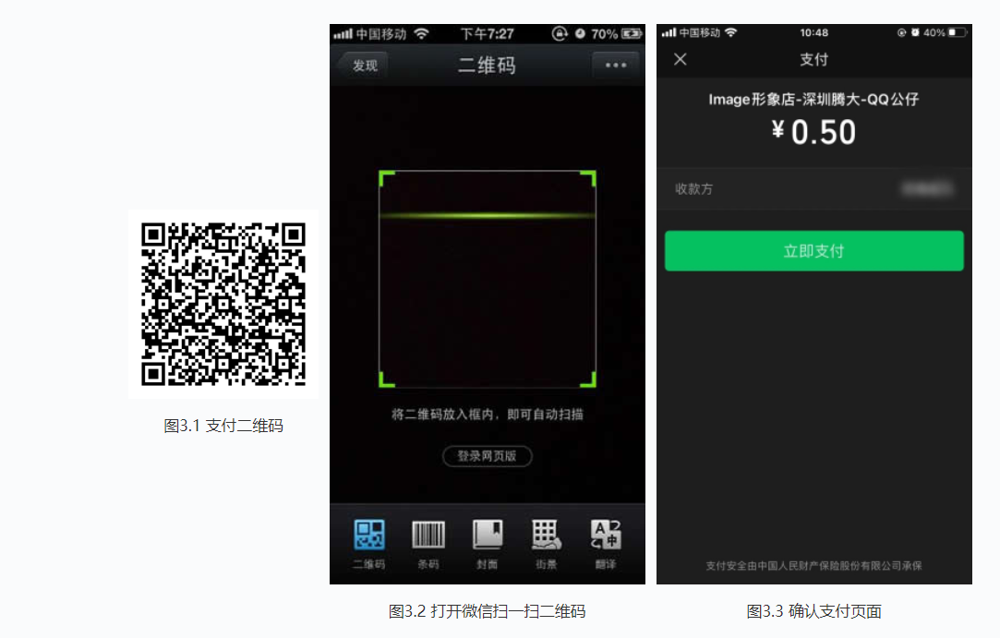
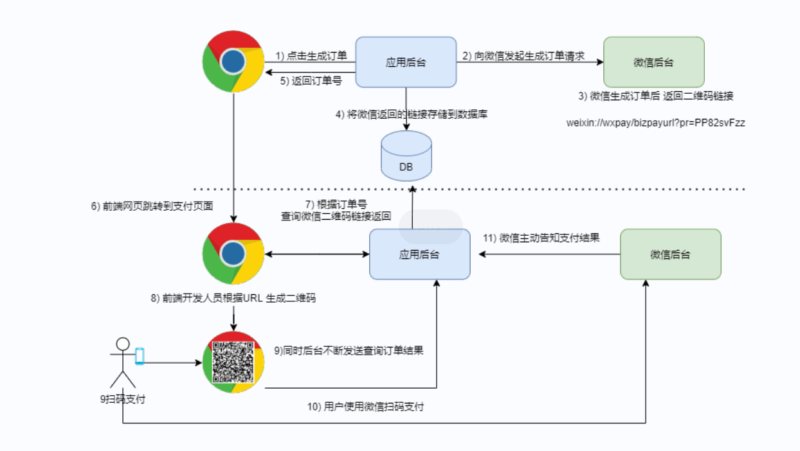

# 微信扫码支付

```properties
参考文档
https://pay.weixin.qq.com/wiki/doc/apiv3/open/pay/chapter2_7_0.shtml
```

## 1.简介

Native支付是指商户系统按微信支付协议生成支付二维码，用户再用微信“扫一扫”完成支付的模式。

#### 应用场景

Native支付适用于PC网站、实体店单品或订单、媒体广告支付等场景

用户扫描商户展示在各种场景的二维码进行支付，具体操作流程如下：

```
步骤一:商户根据微信支付的规则，为不同商品生成不同的二维码（如图3.1），展示在各种场景，用于用户扫描购买。
步骤二:用户使用微信“扫一扫”（如图3.2）扫描二维码后，获取商品支付信息，引导用户完成支付（如图3.3）。
```



## 2.流程图



## 3 JAVA

对微信支付开发者文档中给出的API进行了封装。

```xml
 <!--   微信扫码支付   -->
 <dependency>
     <groupId>com.github.wxpay</groupId>
     <artifactId>wxpay-sdk</artifactId>
     <version>0.0.3</version>
 </dependency>
```

com.github.wxpay.sdk.WXPay类下提供了对应的方法：

| 方法名 | 说明 |
| ------ | ---- |
|microPay|刷卡支付|
|unifiedOrder| 统一下单|
|orderQuery |查询订单|
|reverse |撤销订单|
|closeOrder| 关闭订单|
|refund |申请退款|
|refundQuery |查询退款|
|downloadBill |下载对账单|
|report |交易保障|
|shortUrl |转换短链接|
|authCodeToOpenid |授权码查询openid|

### 3.1定义工具类

```java

public class PayConfig implements WXPayConfig {

    //企业方公众号Id 固定,需要营业执照申请
    public static String appId = "wx8397f8696b538317";
    //财付通平台的商户账号
    public static String partner = "1473426802";
    //财付通平台的商户密钥
    public static String partnerKey = "T6m9iK73b0kn9g5v426MKfHQH7X8rKwb";


    @Override
    public String getAppID() {
        return appId;
    }

    @Override
    public String getMchID() {
        return partner;
    }

    @Override
    public String getKey() {
        return partnerKey;
    }

    @Override
    public InputStream getCertStream() {
        return null;
    }

    @Override
    public int getHttpConnectTimeoutMs() {
        return 8000;
    }
    @Override
    public int getHttpReadTimeoutMs() {
        return 10000;
    }
}
```

## 3.1 订单操作服务

```java
package com.hmall.order.test;

import com.github.wxpay.sdk.WXPay;
import com.hmall.order.utils.PayConfig;
import com.hmall.order.utils.PayUtil;
import org.junit.Test;

import java.util.HashMap;
import java.util.Map;

public class TestPayService {
    private PayConfig config = new PayConfig();


    /*
    统一下单服务
    https://pay.weixin.qq.com/wiki/doc/apiv3/apis/chapter3_4_1.shtml
     */
    @Test
    public void createNative() {
        String out_trade_no = PayUtil.getId("01"); // 订单号,唯一
        System.out.println(out_trade_no);
        String total_fee = "1"; // 金额,单位 分
        String goodsId = "1"; // 商品id
        WXPay wxPay = new WXPay(config);
        Map<String, String> data = new HashMap<String, String>();
        data.put("body", "黑马商城");
        data.put("out_trade_no", out_trade_no);
        data.put("device_info", "");
        data.put("fee_type", "CNY");
        data.put("total_fee", total_fee);
        data.put("spbill_create_ip", "127.0.0.1");// 订单创建ip
        // 回调地址
        data.put("notify_url", "http://127.0.0.1/pay/callBack");
        data.put("trade_type", "NATIVE");  // 此处指定为扫码支付
        data.put("product_id", goodsId);

        try {
            Map<String, String> resp = wxPay.unifiedOrder(data);
            System.out.println(resp);

        } catch (Exception e) {
            e.printStackTrace();
        }

    }

    // 查询订单状态
    @Test
    public void queryNative() {
        String out_trade_no = "2022071818273601550320"; // 订单号,唯一
        WXPay wxPay = new WXPay(config);
        Map<String, String> data = new HashMap<>();
        data.put("out_trade_no", out_trade_no);
        try {
            Map<String, String> resp = wxPay.orderQuery(data);
            System.out.println(resp);
        } catch (Exception e) {
        }

    }
    
    // 关闭订单
    @Test
    public void closeNative() {
        String out_trade_no = "2022071818273601550320"; // 订单号,唯一

        PayConfig config = new PayConfig();
        WXPay wxpay = new WXPay(config);
        Map<String, String> data = new HashMap<String, String>();
        data.put("out_trade_no", out_trade_no);
        try {
             Map<String, String> response = wxpay.closeOrder(data);
            System.out.println(response);
        } catch (Exception e) {
            e.printStackTrace();
        }
    }
    // 下载账单,用于月底对账
    @Test
    public void downloadBill() throws Exception {
        WXPay wxpay = new WXPay(config);
        Map<String, String> data = new HashMap<String, String>();
        data.put("bill_date", "20220717");
        data.put("bill_type", "ALL");
        try {
            Map<String, String> resp = wxpay.downloadBill(data);
            System.out.println(resp);
        } catch (Exception e) {
            e.printStackTrace();
        }
    }
}

```


