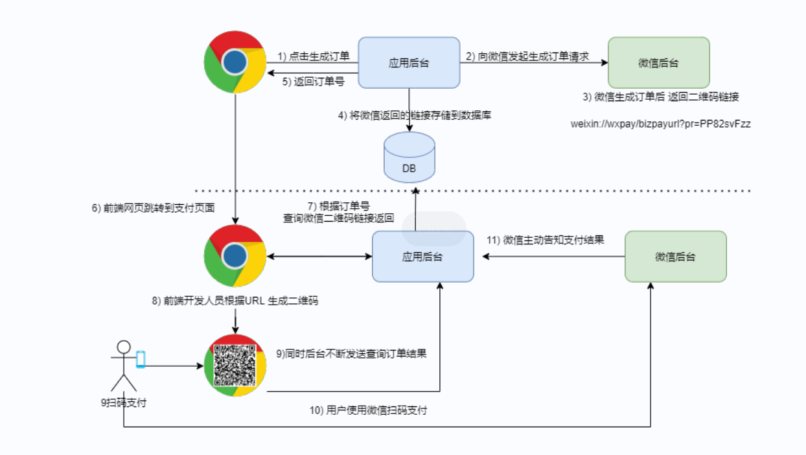

## 7.微信支付需求



### 7.1 下单是增加调用微信下单接口

> 说明:修改下单代码增加微信支付是调用微信下单接口,同时间微信返回的 code_url 存入数据库

### 7.2 订单查询

```
增加根据订单id 查询订单详情接口(显示订单信息)
请求方式 GET
请求路径: /order/{id}
其他参数:无
返回值
{
	id:
	totalFee:
	paymentType:
	userId:
	status:
	createTime:
	payTime:
	consignTime:
	endTime:
	wxCodeUrl:
	tradeNo:
	updateTime:
	commentTime
}
```

### 7.2 订单状态查询

```
增加根据订单id 查询订单状态接口
请求方式 GET
请求路径: /order/status/{id}
其他参数:无
返回值: Integer
	订单状态,
	1、未付款 
	2、已付款,未发货 
	3、已发货,未确认 
	4、确认收货，交易成功
    5、交易取消，订单关闭 
    6、交易结束
    
```

### 7.3 查询支付二维码url

```
增加根据订单id 查询订单状态接口
请求方式 GET
请求路径: /pay/url/{type}/{id}
参数:
	type 支付方式 1,支付宝,2微信
	id: 订单id
返回值: String
返回微信给的url
```

### 7.4 查询支付状态

```
增加根据订单id 查询订单支付状态
请求方式 GET
请求路径: /pay/status/{id}
参数:
	id: 订单id
返回值: String
      1: 未支付
      2: 已支付
      3: 查询异常
```

### 7.5 回调方法

支付成功后微信会调用该方法

```
参考
https://pay.weixin.qq.com/wiki/doc/apiv3/apis/chapter6_1_22.shtml
```


```
请求方式:任意请求方式均可以
按照微信要求封装返回
```

```javascript
 //回调接口
    @RequestMapping("callBack")
    public String callBack(HttpServletRequest request, HttpServletResponse response) throws Exception {
        System.out.println("接口已被调用");
        ServletInputStream inputStream = request.getInputStream();
        String notifyXml = StreamUtils.inputStream2String(inputStream, "utf-8");
        System.out.println(notifyXml);

        // 解析返回结果
        Map<String, String> notifyMap = WXPayUtil.xmlToMap(notifyXml);
        // 判断支付是否成功
        if ("SUCCESS".equals(notifyMap.get("result_code"))) {
            //编写自己的实现逻辑
            // 支付成功：给微信发送我已接收通知的响应
            // 创建响应对象
            String out_trade_no = notifyMap.get("out_trade_no");
            //更新支付状态为已支付
            orderService.update(Wrappers.<Order>lambdaUpdate().set(Order::getStatus,"2")
                    .eq(Order::getTradeNo,out_trade_no));

            Map<String, String> returnMap = new HashMap<>();
            returnMap.put("return_code", "SUCCESS");
            returnMap.put("return_msg", "OK");
            String returnXml = WXPayUtil.mapToXml(returnMap);
            response.setContentType("text/xml");
            System.out.println("支付成功");
            return returnXml;
        }
        // 创建响应对象：微信接收到校验失败的结果后，会反复的调用当前回调函数
        Map<String, String> returnMap = new HashMap<>();
        returnMap.put("return_code", "FAIL");
        returnMap.put("return_msg", "");
        String returnXml = WXPayUtil.mapToXml(returnMap);
        response.setContentType("text/xml");
        System.out.println("校验失败");
        return returnXml;
    }
```

